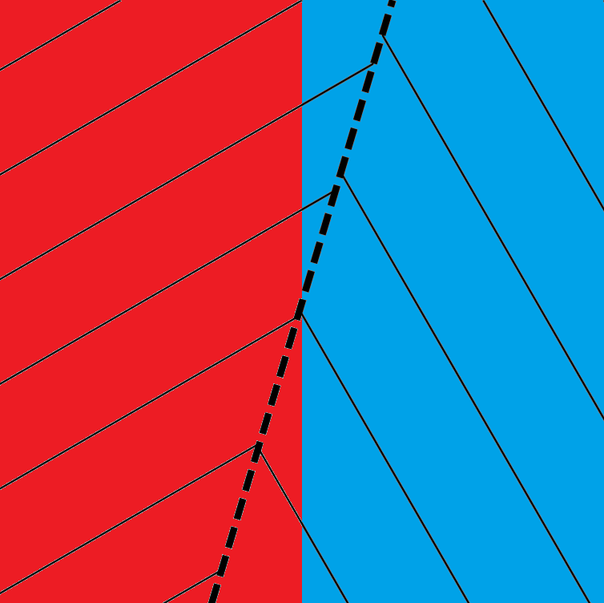

## معرفی

ایده محوری کتاب [Theodore Sider, Writing the Book of the World, Oxford University Press, 2011](https://academic.oup.com/book/3171) این است که برای توصیف کامل جهان، صرفا «صادق بودن» کافی نیست؛ بلکه باید از مفاهیم درست استفاده کرد، مفاهیمی که ساختار واقعی جهان را بازتاب دهند. سایدر این ویژگی را با تعبیر مشهور دیوید لوئیس، یعنی carving nature at the joints («طبیعت را از مفاصلش بریدن») توضیح می‌دهد و آن را از محمول‌ها به سایر اجزای زبان، حتی منطق، گسترش می‌دهد. از نظر او متافیزیک در اصل مطالعه ساختار بنیادین واقعیت است.

«طبیعت را از مفاصلش بریدن (یا تقسیم کردن)» تعبیری استعاری که دیوید لوئیس برای اشاره به تمایزگذاری مفهومیِ منطبق با ساختار عینی و واقعی جهان به کار می‌برد. همان‌گونه که بریدن یک شیء در محل مفاصل طبیعی آن، بخش‌های حقیقی و از پیش موجود آن را از یکدیگر جدا می‌کند، یک مفهوم یا محمول نیز هنگامی «طبیعت را از مفاصلش می‌بُرد» که تمایزی را نشان دهد که در خود واقعیت، مبنایی عینی داشته باشد. برای مثال، سایدر «green» (سبز) را در قیاس با «grue»(سبز آبی)[^1] مفهومی می‌داند که بهتر مشابهت‌های عینی میان اشیا را نشان می‌دهد. بنابراین، مراد از این تعبیر صرفا دسته‌بندی اشیا نیست، بلکه بازشناسی مفاصل ساختاری واقعیت از طریق مفاهیم است. سایدر این ایده لوئیسی درباره طبیعت‌مندی (naturalness) را گسترش می‌دهد و آن را به ساختار (structure) تعمیم می‌بخشد.

آشنایی من با این کتاب از فرصت فوق العاده مصاحبت و بهره مندی از سخاوت علمی جناب آقای **دکتر محسن زمانی**، نویسنده و مترجم حوزه فلسفه تحلیلی حاصل شد. همچنین ایشان تطبیق و تقریبی از ایده سایدر با مسأله «تدوین نظام صوری اصالت وجود» نیز مطرح کردند که راهنماست:

> در میانِ جمله‌هایِ صادقی درباره‌یِ جهان می گوییم، برخی از برخی دیگر به‌تر، ساختارِ جهان را نشان می‌دهند.
>  
> مثلاً این جفت جمله را در نظر بگیرید: _«در این اتاق میزی وجود دارد» و «در این اتاق اتم‌هایِ میزشکلی وجود دارد»_ (برای کسی که اشیاءِ مرکب را چیزی ورایِ اجزای‌اش نمی‌داند.) یا این جمله‌ها را _«این میز قرمز است» و «این میز کلی قرمز بودن را نمونه‌دار کرده است»/«این میز عضوِ مجموعه‌یِ چیزهایِ قرمز است.»_ (به ترتیب اگر درباره‌یِ کلی‌ها واقع‌گرا باشیم/درباره‌یِ ویژگی‌های نومینالیست باشیم.)
>  
> ایده این است که برخی ترم‌هایِ **زبان/مفاهیم** از برخی ترم‌هایِ دیگر **زبان/مفاهیم**، به‌تر جهان را تقسیم می‌کنند: _جهان را از مفاصل‌اش تقسیم می‌کنند._ با هر دو دسته از **ترم‌ها/مفاهیم** می‌توانند صدق‌هایی درباره‌یِ جهان گفت، اما اولی‌ها به این معنی مرجح اند که به‌تر ساختارِ جهان را نشان می‌‌دهند.
>  
> این نکته که صدق‌هایِ «کم‌دقت» اول هنوز صادق اند با این امر مشخص می‌‌شود که «ترجمه‌هایی» بر اساسِ صدق‌هایِ «ساختارنمای» جهان دارند («ترجمه» اصطلاحی دقیق نیست، سایدر می‌گوید «معناشناسیِ متافیزیکی»، اما فعلاً این دقت برایِ منظورِ ما کافی است.) با این کار هم بسیاری از صدق‌‌هایِ زبانِ طبیعی حفظ می‌شوند، پس در تعارض با ارتکازهایِ ما نیستند، هم تمایزشان با صدق‌‌هایِ ساختارنما مشخص می‌شود. هدفِ متافیزیک هم رسیدن به زبانی ساختارنما است.
>  
> با این مقدمه می‌توان گفت که تعبیرِ سایدری ایده‌یِ شما چینن چیزی است: ادعا این است که اصالتِ وجود، ساختارِ جهان را چنان که هست مشخص می‌کند. می‌ توان با اصطلاحاتی اصالتِ ماهیتی هم صدق‌هایی درباره‌یِ جهان گفت، اما این صدق‌ها ساختارنما نیستند. این نکته را به این صورت می‌توان بیان کرد: می‌توان «ترجمه‌ای» در زبانِ اصالتِ وجودی از به زبانِ اصالتِ ماهیتی به دست داد و راهِ عکس مسدود است.

بر این اساس، این کتاب حداقل از چهار جهت می تواند به موضوع رساله من مرتبط باشد:

1. اگر کسی از من بپرسد گیریم که زبانی متناظر با اصالت وجود ساخته شد. حالا که چه؟ می توانم به استدلال سایدر استناد کنم که اینکه زبان طبیعی و منطق کلاسیک توصیف صادقی از عالم واقع دارند کافی نیست. چنانچه مقدمه کتاب با این عبارت شروع می شود: «جهان دارای ساختاری متمایز و توصیفی برگزیده است» و باید دید آن ساختار و توصیف اصلی کدام است.

2. ایده «ساختار جهان» (Structure) به پروژه من نزدیک است، من هم می‌خواهم یک نظام صوری بسازم که صرفا زبان نباشد، بلکه مدعی بازنمایی ساختار نفس‌الامر باشد.

3. بحث‌های او درباره مفاهیم بنیادین (fundamentality)، منطق، هستی‌شناسی و متامتافیزیک می‌تواند در فصل «مبانی نظری نظام‌های صوری» و همچنین در دفاع از اینکه چرا نظام من صرفا یک قرارداد زبانی نیست، مفید باشد.

4. بحث از تصوّر«منطق صحیح» (Correct Logic) در فصل دهم ناظر به این پرسشی است شبیه به مسأله من: آیا طرح ایده منطق مطابق با واقع متصوّر است؟ سایدر معتقد است مناقشات درباره «منطق صحیح» (_Correct Logic_) واقعی‌اند و نه زبانی یا مفهومی؛ یعنی آنها به همان اندازه مناقشات هستی‌شناختی، محتوایی هستند.

در ادامه **ترجمه ماشینی ویرایش شده** دیباچه و فصل اوّل این کتاب از نظر خواهد گذاشت. در این ترجمه چون با یک متن تخصصی مواجه بودم و اکثر واژه ها یک معنای اصطلاحی دارند بدون اینکه از شلوغ شدن عبارات مردد شوم خواستم برای هر معادل فارسی عین واژه انگلیسی در پرانتز ذکر شود تا یادم نرود اینها ممکن است در معنای متداول به کار نرفته باشند. همچنین معرفی مختصر اصطلاحات ناآشنا (برای من) به پاورقی اضافه شدند:

## دیباچه

درون‌مایه اصلی این کتاب عبارت است از: **واقع‌گرایی درباره ساختار** (_Realism about Structure_). یعنی جهان دارای ساختاری متمایز (_distinguished structure_) و توصیفی برگزیده (_privileged description_) است. به عبارت دیگر برای آنکه یک بازنمایی (_Representation_) کاملا موفق باشد، صرفِ صدق کافی نیست؛ بلکه بازنمایی باید از مفاهیم درست (_Right Concepts_) نیز استفاده کند، به‌گونه‌ای که ساختار مفهومی (_Conceptual Structure_) آن با ساختار واقعیت (_Reality’s Structure_) مطابقت داشته باشد. به دیگر سخن برای «تحریر کتاب عالم»(عنوان کتاب) راهی وجود دارد که به‌طور عینی (_Objectively_) درست است.

واقع‌گرایی درباره ساختار محمول‌ها (_Predicate Structure_) تا اندازه زیادی پذیرفته شده است. بسیاری ــ به‌ویژه کسانی که تحت تاثیر دیوید لوئیس هستند ــ بر این باورند که برخی محمول‌ها (مثلاً سبز _green_) در نشان دادن مشابهت‌های عینی (_Objective Similarities_) بهتر از برخی دیگر (مثلاً سبزآبی _grue_ ) عمل می‌کنند؛ یعنی طبیعت را دقیقاً از مفاصلش تقسیم می کنند.

اما این واقع‌گرایی باید فراتر از محمول‌ها گسترش یابد و تعابیر (_Expressions_) متعلق به سایر مقولات دستوری (_Grammatical Categories_)، از جمله تعابیر منطقی (_Logical Expressions_)، را نیز دربرگیرد. فرض کنید عبارت «شبه‌وجود دارد یک F» (_There schmexists an F_)[^2] به این معنا باشد که خاصیتِ (F) بودن (_The Property of Being an F_) به وسیله یک محمول در یکی از جمله‌های این کتاب بیان شده است. «شبه‌وجود دارد» (_Schmexists_) مفاصل طبیعت را در جای خود نمی‌بُرد؛ نسبت آن به سور وجودی (_There Exists_) همانند نسبت «grue» به «green» است. همچنین، پرسش از بریدن طبیعت از مفاصلش (_Joint-Carving_) را می‌توان درباره «قیدهای محمول»[^3] (_Predicate Modifiers_)، «ادات ربط جمله‌ای»[^4] (_Sentential Connectives_) و تعابیر متعلق به سایر مقولات دستوری نیز مطرح کرد.

من ساختار را به بنیادین‌بودن (_Fundamentality_) پیوند می‌دهم. مفاهیمی که طبیعت را از مفاصلش می‌برند (_Joint-Carving Notions_)، مفاهیم بنیادین (_Fundamental Notions_) هستند؛ و یک واقعیت (_Fact_) هنگامی بنیادین است که با اصطلاحاتی بیان شود که طبیعت را از مفاصلش می‌برند. یکی از وظایف محوری متافیزیک همواره تشخیص (_Discern_) واقعیت نهایی یا بنیادینی بوده است که در زیرِ ظواهر (_Appearances_) قرار دارد. من این وظیفه را «پژوهش در ساختار واقعیت» (_Investigation of Reality’s Structure_) می‌دانم.

پرسش درباره اینکه کدام تعابیر طبیعت را از مفاصلش می‌بُرند، در واقع پرسش درباره این است که واقعیت تا چه حد ساختار در خود دارد. اینکه آیا واقعیت دارای ساختار علّی (_Causal Structure_)، یا ساختار وجودشناختی (_Ontological Structure_)، یا ساختار وجهی (_Modal Structure_) است، به این امر بستگی دارد که آیا محمول‌های علّی (_Causal Predicates_)، سورها (_Quantifiers_) یا نام‌ها (_Names_) و عملگرهای وجهی (_Modal Operators_) طبیعت را از مفاصلش می‌برند یا نه. چنین پرسش‌هایی در مرکز فرامتافیزیک (_Metametaphysics_) قرار دارند. برای مثال، کسانی که می‌گویند پرسش‌های وجودشناسی (_Ontology_) «صرفا لفظی» (_Merely Verbal_) هستند، بهتر است چنین فهمیده شوند که معتقدند واقعیت فاقد «ساختار وجودشناختی» (_Ontological Structure_) است.

چنین مواضع تحویل‌گرایانه در فرامتافیزیک[^5] (_Deflationary Metametaphysical Stances_)، خود مواضعی متافیزیکی (_Metaphysical Stances_) هستند. هیچ «نقطه ارشمیدسیِ غیرمتافیزیکی»[^6] (_Ametaphysical Archimedean Point_) وجود ندارد که بتوان از آنجا فرامتافیزیک تحویل‌گرا (_Deflationary Metametaphysics_) را پیش برد؛ زیرا هر فرامتافیزیکی از این دست، دست‌کم به این مقدار از «متافیزیک محتوایی»[^7] (_Substantive Metaphysics_) متعهد است: واقعیت فاقد نوع خاصی از ساختار است.

یک درون‌مایه فرعی (_Subsidiary Theme_) این است: **ایدئولوژی اهمیت دارد** (_Ideology Matters_). گرایشی نامطلوب وجود دارد ــ که شاید اصطلاح‌شناسی نادرست نیز آن را تقویت کرده باشد ــ که مفهوم ایدئولوژی در اندیشه کواین را روان‌شناختی کند؛ یعنی انتخاب مفاهیم اولیه (_Primitive Notions_) یک نظریه ــ یعنی ایدئولوژی آن ــ را صرفا امری روان‌شناختی، زبانی یا قراردادی (_Psychological, Linguistic, or Conventional Matter_) بدانیم.

فیلسوفان، ایدئولوژی مخالفان خود را با اصطلاحات روان‌شناختی/معنایی (_Psychological/Semantic Terms_) رد می‌کنند: «من نمی‌فهمم منظورتان از آن چیست.» و هنگامی که ایدئولوژی خود را معرفی می‌کنند، مانع دیگری که باید از آن عبور کرد، باز هم روان‌شناختی/معنایی است: مفاهیم اولیه باید «قابل فهم» (_Intelligible_) باشند.

اما درباره هر قطعه پیشنهادی از ایدئولوژی (مانند عملگرهای وجهی یا سورهای مرتبه دوم)، مسئله‌ای کاملا متافیزیکی وجود دارد: آیا واقعیت ساختار لازم را در خود دارد؟ اگر چنین باشد، آنگاه «قابل فهم بودن» بر اساس اصطلاحاتی که پیش‌تر «فهمیده شده‌اند»، برای ارجاع موفق (_Successful Reference_) به آن ساختار و نظریه‌پردازی درباره آن لازم نیست؛ همان‌گونه که در متافیزیک نیز بیش از فیزیک چنین الزامی وجود ندارد.

تغییر تمرکز از محدودیت‌های روان‌شناختی/معنایی (_Psychological/Semantic Constraints_) به محدودیت‌های متافیزیکی (_Metaphysical Constraints_) درباره ایدئولوژی، گاه برای متافیزیک رهایی‌بخش است؛ اما همزمان ما را بر زمین نگه می‌دارد، زیرا گرایش به گریز از تعهدات وجودشناختی (_Ontological Commitments_) از طریق افزودن بر ایدئولوژی را مهار می‌کند.

ایدئولوژی یک نظریه بنیادین به همان اندازه بخشی از محتوای بازنمایی (_Representational Content_) آن است که هستی‌شناسی آن؛ زیرا آن نظریه، جهان را چنان بازنمایی می‌کند که گویی دارای ساختاری متناظر با تعابیر اولیه (_Primitive Expressions_) آن است. و جهانی که مطابق یک نظریه متورم از حیث ایدئولوژیک (_Ideologically Bloated Theory_) تصویر می‌شود، ساختاری به‌مراتب پیچیده‌تر از جهانی دارد که مطابق یک نظریه کم‌ایدئولوژی‌تر (_Ideologically Leaner Theory_) تصویر می‌شود؛ چنین پیچیدگی‌ای (_Complexity_) را نباید به‌آسانی مفروض گرفت.

تمرکز افراطی بر هستی‌شناسی و نادیده گرفتن ایدئولوژی، هم بیش از اندازه محدود(_narrow _) است و هم احتیاط‌ناپذیر(_incautious_). این رویکرد از آن جهت بیش از اندازه محدود است که هدف متافیزیک ارائه توصیفی بنیادین از جهان است، و انجام این کار چیزی بیش از صرفا بیان اینکه چه چیزهایی وجود دارند را می‌طلبد. و از آن جهت احتیاط‌ناپذیر است که به‌طور انتقادی‌نشده فرض می‌کند ساختار کمّی (_Quantificational Structure_) بنیادین است. اگر ساختار کمّی واقعا بنیادین باشد -چنان‌که من معتقدم چنین است- هستی‌شناسی، شایسته جایگاه خود در متافیزیک بنیادین است. اما اگر ساختار کمّی بنیادین نباشد، آنگاه پژوهش هستی‌شناختی در متافیزیک بنیادین، شایسته توجهی بیشتر از پژوهش درباره موضوع بی اهمیتی مثل ماهیت دستکش‌های مخصوص بازیکن بیسبال (_Catcher’s Mitts_) نیست.

درون‌مایه نهایی، «تلقی ناب» (_Pure Conception_) از متافیزیک است؛ تلقی‌ای که از برخی قیود و موانع (_Encumbrances_) رها باشد. یکی از این موانع، انجام دادن متافیزیک، عمدتا با اصطلاحات وجهی (_Modal Terms_) است. در مخالفت با این امر، توافقی رو به رشد وجود دارد که مفاهیم وجهی (_Modal Notions_) برای متافیزیک بیش از اندازه کلی و خشن (_Too Coarse_) هستند، و اینکه مفاهیمی حول «بنیادین‌بودن»[^8] (_Fundamentality_)، «به اعتبارِ»[^9] (_In Virtue Of_) و مانند آن، نباید با اصطلاحات وجهی فهمیده شوند.

مانع دوم، درهم‌تنیدگی‌های زبانی (_Linguistic Entanglements_) است. در اینجا نیز توافقی رو به رشد وجود دارد: اینکه برای نظریه متافیزیکی و نظریه زبانی (_Metaphysical and Linguistic Theory_) چندان مهم نیست که به‌طور دقیق و منظم با یکدیگر هماهنگ باشند. متافیزیک بنیادینی که در زیرِ یک گفتمان (_Discourse_) قرار دارد، ممکن است ساختاری کاملا متفاوت از ساختاری داشته باشد که آن گفتمان پیشنهاد می‌کند. در حالی که یک نظریه زبانی خوب باید با ساختار پیشنهادی (_Suggested Structure_) سازگار باشد، متافیزیک خوب باید با ساختار زیرین (_Underlying Structure_) سازگار باشد.

این کتاب برای من یک چالش سازمان‌دهی (_Organizational Challenge_) هم داشت. ساختارِ «نظریه سپس کاربردها» (_Theory-Then-Applications_) از نظر نظم، بهترین حالت را داشت؛ اما مفهوم ساختاربه اندازه‌ای ناآشنا است که خوانایی کتاب نیازمند کاربردهای اولیه بود. راه‌حل میانه من این بود که این دو را درهم بیامیزم.

فصل اول مفهوم ساختار (_Concept of Structure_) را معرفی می‌کند و به‌صورت مقدماتی توضیح می‌دهد که این مفهوم چگونه به کار گرفته خواهد شد. فصل دوم ارائه نظریه را آغاز می‌کند؛ در این فصل استدلال می‌شود که ساختار امری نخستین و عینی (_Primitive and Objective_) است، و از یک معرفت‌شناسی ساختار (_Epistemology of Structure_) دفاع می‌شود.

فصل‌های ۳ تا ۵ به کاربردها (_Applications_) می‌پردازند و نشان می‌دهند که ساختار چگونه تبیین (_Explanation_) و قوانین (_Laws_)، ارجاع (_Reference_)، معرفت‌شناسی (_Epistemology_)، هندسه فیزیکی (_Physical Geometry_)، ذاتی‌بودن (_Substantivity_) و فرامتافیزیک (_Metametaphysics_) را روشن می‌سازد. فصل‌های ۶ تا ۸ دوباره به نظریه بازمی‌گردند و استدلال می‌کنند که تعابیر (_Expressions_) متعلق به هر مقوله دستوری (_Grammatical Category_) ــ نه فقط محمول‌ها (_Predicates_) ــ می‌توانند از حیث ساختار (_Structure_) ارزیابی شوند؛ همچنین به پرسش‌های انتزاعی گوناگونی درباره چگونگی رفتار ساختار (_How Structure Behaves_) می‌پردازند و برخی مفاهیم رقیب -مانند صدق‌سازندگی (_Truthmaking_) و بنیاد (_Ground_)- را نقد می‌کنند.

فصل‌های ۹ تا ۱۲ دوباره به کاربردها بازمی‌گردند و نشان می‌دهند که متافیزیک چهار حوزه ــ هستی‌شناسی، منطق، زمان و وجهیت (_Modality_) ــ هنگامی که بر اساس مفهوم ساختار صورت‌بندی شود، چگونه خواهد بود. فصل ۱۳ با طرحی اجمالی از یک «جهان‌بینی» (_Worldview_) پایان می‌یابد: متافیزیکی جامع که بر اساس مفهوم ساختار صورت‌بندی شده است.

برای راهنمایی کسانی که مایل‌اند کتاب را به‌صورت گزینشی بخوانند:

- **متافیزیک ساختار (_Metaphysics of Structure_):** فصل‌های ۱، ۲، ۶ تا ۸؛

- **کاربردها (_Applications_):** فصل‌های ۳ تا ۵، ۹ تا ۱۲؛

- **فرامتافیزیک (_Metametaphysics_):** فصل‌های ۴ تا ۵، ۹ و (تا اندازه‌ای کمتر) ۱۰ تا ۱۲؛

- **ترکیبی از متافیزیک مرتبه اول و فرامتافیزیک (_Mix of First-Order and Metametaphysics_):** فصل‌های ۹ تا ۱۳.

مایلم از کیت فاین (_Kit Fine_)، جان هاثورن (_John Hawthorne_) و فیلیپ بریکر (_Phillip Bricker_) تشکر کنم. در سال‌های گذشته، از گفتگو با کیت درباره بنیادین‌بودن (_Fundamentality_) و از اندیشیدن درباره نوشته‌های او در این زمینه بسیار آموخته‌ام. جان بخش‌های بزرگی از دست‌نوشته را خواند و دیدگاه‌های ارزشمند بسیاری به من ارائه کرد؛ همچنین سال‌ها پیش مرا تشویق کرد که از محدوده محمول‌ها فراتر روم. فیل راهنمای رساله دکتری من بود؛ رساله‌ای که درباره طبیعت‌مندی لوئیسی (_Lewisian Naturalness_) بود. او قدرت این ایده را، چگونگی کاربرد آن در فلسفه فضا و زمان و بسیار چیزهای دیگر به من آموخت. بدهی فکری من به فیل عظیم است.

در نهایت، باید روشن باشد که این کتاب تا چه اندازه وام‌دار دیوید لوئیس است. ایده‌های او درباره خواص و روابط طبیعی (_Natural Properties and Relations_) همواره از نظر من در شمار بهترین اندیشه‌های او بوده‌اند: قدرتمند، درست، انقلابی و در عین حال عمیقا شهودی.

## فصل اول: ساختار

متافیزیک (_Metaphysics_)، در بنیاد، درباره ساختار بنیادین واقعیت (_Fundamental Structure of Reality_) است. نه درباره آنچه ضرورتا صادق است (_Necessarily True_). نه درباره اینکه کدام خواص ذاتی‌اند (_Essential Properties_). نه درباره تحلیل مفهومی (_Conceptual Analysis_). نه درباره اینکه چه چیزهایی وجود دارند (_What There Is_). بلکه درباره **ساختار**.

پژوهش درباره ضرورت (_Necessity_)، ذات (_Essence_)، مفاهیم (_Concepts_) یا هستی‌شناسی (_Ontology_) ممکن است به روشن شدن ساختار واقعیت کمک کند. اما هدف نهایی، دستیابی به بصیرت (_Insight_) نسبت به خود این ساختار است؛ بصیرت نسبت به اینکه جهان در بنیادی‌ترین سطح، چگونه است.

### ساختار: نخستین مواجهه

تشخیص «ساختار» به معنای تشخیص الگوها (_Patterns_) است. یعنی دریافتن مقولات درست (_Right Categories_) برای توصیف جهان. یعنی، به تعبیر افلاطون، «واقعیت را از مفاصلش بریدن». یعنی پژوهش در اینکه جهان در بنیاد چگونه است، در مقابلِ اینکه ما در حالت معمول چگونه درباره آن سخن می‌گوییم یا چگونه آن را در نظر می‌آوریم.

سه شیء را در نظر بگیرید: دو الکترون در حالت ذاتی و یکسان، و یک گاو. طبیعی‌ترین امر در جهان این است که بگوییم الکترون‌ها دقیقا شبیه یکدیگرند و هیچ‌یک از آنها دقیقا شبیه گاو نیست. این سه شیء باید به دو گروه تقسیم شوند: گروهی که شامل الکترون‌هاست و گروهی که شامل گاو است. الکترون‌ها با یکدیگر هم‌گروه‌اند و هیچ‌یک با گاو هم‌گروه نیست.

یا جهانی را تصور کنید که سراسر از امر سیال (_Fluid_) پر شده است. یک صفحه (_Plane_) جهان را به دو نیمه تقسیم می‌کند؛ در یکی از آنها امر سیال به‌طور یکنواخت قرمز (_Red_) است و در دیگری سیال به‌طور یکنواخت آبی (_Blue_) است (تصویر 1.1).

_تصویر 1.1: جهان قرمز-آبی_

حالا گروهی از مردم را تصور کنید که وقتی با این جهان مواجه می‌شوند، برای صفحه آبی ـ قرمزِ تقسیم‌کننده (_Blue-Red Dividing Plane_) هیچ جایگاه ویژه‌ای قائل نیستند. آنان به جای آنکه جهان را متشکل از نیمه قرمز و نیمه آبی بدانند، تصور می‌کنند که جهان به وسیله صفحه دیگری، که با خط‌چین در تصویر 1.2 مشخص شده است، به دو نیمه تقسیم شده است.

_تصویر 1.2: برش نامتعارف جهان قرمز ـ آبی_

آنان همچنین از هیچ محمولی که به معنای قرمز و آبی باشد استفاده نمی‌کنند. در عوض، جفتی از محمول‌ها دارند که آنها را به‌طور یکنواخت درون دو ناحیه‌ای به کار می‌برند که به وسیله صفحه تقسیم‌کننده آنان از یکدیگر جدا شده‌اند. این محمول‌ها -که بسط‌ آنها در نمودار با خطوط هاشوری مورب نشان داده شده‌اند) از میان محمول‌های «قرمز» و «آبی» عبور می‌کنند. نواحی سمت چپ خط‌چین را «bred»(ترکیب ساختگی از blue+red) و نواحی سمت راست را «rue»(ترکیب ساختگی از قرمز و آبی) می‌نامند.

تقریبا مقاومت‌ناپذیر است که این افراد را در حال اشتباه توصیف کنیم. اما آنها درباره اینکه نواحی قرمز و آبی کجا قرار دارند، مرتکب اشتباه نشده‌اند؛ زیرا هیچ ادعایی درباره قرمز یا آبی مطرح نمی‌کنند. همچنین، هنگامی که مفاهیم خودشان را به کار می‌برند، مرتکب هیچ اشتباهی نمی‌شوند. نواحی‌ای که آنها «bred» می‌نامند، واقعا bred هستند و نواحی‌ای که «rue» می‌نامند، واقعا rue هستند!

مشکل این است که آنها مفاهیم نادرستی دارند. آنها جهان را به‌نحو نادرستی تقسیم‌بندی مفهومی می‌کنند. آنان با خودداری از اندیشیدن بر حسب صفحه تقسیم‌کننده قرمز ـ آبی، **چیزی را از دست می‌دهند**. هرچند باورهای آنان صادق‌اند امّا این باورها با ساختار جهان (_World’s Structure_) مطابقت ندارند.

### شکاکیت فلسفی درباره ساختار

همه‌چیز خوب پیش می‌رود تا اینکه با یک فیلسوف مواجه می‌شویم؛ فیلسوفی که، طبق معمول، چند پرسش ناراحت‌کننده مطرح می‌کند. او می‌خواهد بداند چرا این دو الکترون «با یکدیگر هم‌گروه‌اند»؟

درست است که آنها ویژگی‌های مشترک بسیاری دارند: هر یک دارای بار
$1.602\times10^{-19},\mathrm{C}$،
جرم
$9.109\times10^{-31},\mathrm{kg}$
و ویژگی‌های دیگری از این دست است. اما ویژگی‌های بسیاری نیز وجود دارند که این دو الکترون در آنها مشترک نیستند. آنها در مکان‌های متفاوتی قرار دارند، با سرعت‌های متفاوت حرکت می‌کنند و اجزای دو کل متفاوت‌اند.

و چرا گاو با الکترون‌ها هم‌گروه نیست؟ اگر هر سه در آمریکای شمالی قرار داشته باشند، هر سه این ویژگی را دارند که در آمریکای شمالی قرار گرفته‌اند. و هر سه در این ویژگی نیز مشترک‌اند: «الکترون یا گاو بودن».

فیلسوف ادامه می‌دهد: چه اشکالی دارد که جهان قرمز ـ آبی را در امتداد صفحه مورب تقسیم‌بندی کنیم؟ چه اشکالی دارد که چیزهای _bred_ را با یکدیگر و چیزهای _rue_ را با یکدیگر گروه‌بندی کنیم؟ همه چیزهای _bred_ واقعا _bred_ هستند؛ همه آنها این ویژگی را دارند که در سمت چپ صفحه مورب قرار گرفته‌اند.

ممکن است کسی اعتراض کند که همه چیزهای _bred_ شبیه یکدیگر نیستند، زیرا برخی قرمز و برخی آبی هستند؛ اما فیلسوف در پاسخ خواهد گفت که تقسیم‌بندی جهان در امتداد صفحه عمودی نیز از این جهت بهتر نیست. همه چیزهای قرمز شبیه یکدیگر نیستند، زیرا برخی _bred_ و برخی _rue_ هستند.

در واقع، هنگامی که با شیوه اندیشیدن فیلسوف درباره «ویژگی‌ها» (_Features_) آشنا شویم، درمی‌یابیم که هر دو شیء، هم در بی‌نهایت ویژگی با یکدیگر مشترک‌اند و هم از حیث بی‌نهایت ویژگی دیگر با یکدیگر تفاوت دارند.

برای مثال دو شیء $x$ و $y$ را در نظر بگیرید. اگر $Fx$ و $Fy$ به‌ترتیب هر ویژگی از $x$ و $y$ باشند، آنگاه $x$ و $y$ در ترکیب فصلی این ویژگی مشترک‌اند: «یا $Fx$ بودن یا $Fy$ بودن».

همچنین آنها در این ویژگی مشترک‌اند: «یا $Fx$ بودن یا $Fy$ بودن یا یک کیلوگرم جِرم داشتن». و در ترکیب این ویژگی نیز مشترک‌اند: «یا $Fx$ بودن یا $Fy$ بودن یا جرم دو کیلوگرم داشتن». و به همین ترتیب ادامه می‌یابد. بنابراین آنها در بی‌نهایت ویژگی مشترک‌اند.

اما درباره بی‌نهایت ویژگی‌ای که نسبت به آنها متفاوت‌اند، این موارد را در نظر بگیرید: «$Fx$ بودن و در مکان $L$ قرار داشتن» ، «$Fx$-یا-جرم-یک-کیلوگرم-داشتن و در مکان $L$ قرار داشتن»، «$Fx$-یا-جرم-دو-کیلوگرم-داشتن و در مکان $L$ قرار داشتن» و به همین ترتیب. در اینجا $L$ مکانی است که $x$ در آن قرار دارد، اما $y$ در آن قرار ندارد. شیء $x$ هر یک از این ویژگی‌ها را دارد؛ در حالی که شیء $y$ هیچ‌یک از آنها را ندارد.

نکته اصلی، آشکارا، در آمادگی فیلسوف برای پذیرفتن چنین «ویژگی‌هایی» است؛ ویژگی‌هایی مانند «یا الکترون یا گاو بودن» و در نظر گرفتن آنها در یک سطح با ویژگی‌هایی مانند «الکترون بودن» و «گاو بودن». اگر تنها چیزی که در اختیار داشتیم همین ویژگی‌های مورد قبول فیلسوف بود، در آن صورت واقعا نمی‌توانستیم هیچ معنای معقولی برای یک شیوه «درست» (_Correct_) جهت گروه‌بندی سه شیء خود، یا برای این ادعا که الکترون‌ها بیشتر به یکدیگر شباهت دارند تا به گاو، پیدا کنیم.

اما اگر، از سوی دیگر بتوانیم میان **ویژگی‌های اصیل** (_Genuine Features_) ــ یعنی ویژگی‌هایی که بنیادین‌اند (_Fundamental_)، طبیعت را از مفاصلش می‌بُرند و اشتراک در آنها موجب احراز شباهت (_Similarity_) می‌شود ــ و سایر ویژگی‌ها تمایز بگذاریم، آنگاه می‌توانیم همان چیزی را بگوییم که می‌خواهیم. آیا می‌توانیم چنین تمایزی ایجاد کنیم؟

مفاهیم و تمایزاتی که در برابر تعریف شدن بر اساس ایدئولوژی فلسفی رایجِ معاصر مقاومت می‌کنند، معمولا با بدگمانی نگریسته می‌شوند. از این رو، در بخش بزرگی از قرن بیستم، فیلسوفان معمولا از سخن گفتن درباره ویژگی‌های اصیل پرهیز می‌کردند.

برای مثال، بسط‌گرایی کواین[^10] (_Quine’s Extensionalism_) که در دهه‌های ۱۹۵۰ و ۱۹۶۰ مسلط بود، تنها مجموعه‌ای ناچیز از مفاهیم را برای ترسیم تمایزات در اختیار می‌گذاشت؛ تقریبا مفاهیم منطق مرتبه اول به علاوه مجموعه‌ای از محمول‌های علمی (_Scientific Predicates_).

یک بسط‌گرا، با توجه به حضور فصل (_Disjunction_) در تعریفِ بسیاری از ویژگی‌های مورد نظر فیلسوفان، ممکن بود تلاش خود را برای توصیف اصیل‌بودن (_Genuineness_) با کنار گذاشتن ویژگی‌هایی که به این شیوه تعریف شده‌اند، آغاز کند.

اما برای ارزیابی اینکه آیا یک ویژگی «با استفاده از فصل تعریف شده است»، از چه زبانی استفاده کنیم؟ فارسی زبانان برای تعریف این ویژگی باید از واژه «یا» (_or_) استفاده کنند:

> «الکترون یا گاو بودن»

اما گویشوران زبانی که برای این ویژگی یک محمول اولیه (_Primitive Predicate_) دارد ــ فرض کنیم نام آن «blurg» باشد ــ می‌توانند همان بسط (_Extension_) را بدون استفاده از «یا» تعریف کنند.

در واقع، اگر زبان به اندازه کافی نامتعارف باشد، گویشوران آن برای بیان اموری که در فارسی می‌توان آنها را با محمول‌های ساده‌ای مانند «گاو» و «الکترون» بیان کرد، ناگزیر خواهند بود از «یا» و سایر ادات ربط منطقیاستفاده کنند؛ همان‌گونه که ما نیز برای بیان آنچه آنها با استفاده از «blurg» بیان می‌کنند، ناگزیر از استفاده از محمول‌های مرکب منطقی در زبان فارسی هستیم.

تلاش بسط‌گرا برای صورت‌بندی مفهومی از اصیل‌بودن که به‌طور مناسب از زبان مستقل باشد، شکست می‌خورد.[^11]

در دهه ۱۹۷۰، وجهیت (_Modality_) به بخشی پذیرفته‌شده از ایدئولوژی فلسفی تبدیل شد و تلاش‌های تازه‌ای برای تعریف مفاهیمی حول ساختار صورت گرفت. برای مثال، رادریک چیشلم (_Roderick Chisholm_) (۱۹۷۶، ص. ۱۲۷) و جائون کیم (_Jaegwon Kim_) (۱۹۸۲، صص. ۵۹–۶۰) کوشیدند تعریفی وجهی (_Modal Definition_) از مفهوم خاصیت ذاتی (_Intrinsic Property_) ارائه کنند؛ یعنی خاصیتی که یک شیء صرفا به اعتبار آنچه فی‌نفسه هست داراست، مستقل از اینکه چه نسبتی با اشیای دیگر دارد.

آنها، به‌طور تقریبی، پیشنهاد کردند که یک خاصیت ذاتی است اگر و تنها اگر ممکن باشد که شیئی که در جهان تنهاست، مصداق آن خاصیت باشد. اما نشان داده شد که این تعریف پذیرفتنی نیست. خاصیت «در جهان تنها بودن»، و خاصیت «یا (در جهان تنها بودن و قرمز بودن) یا (در جهان تنها نبودن و آبی بودن)»، این تعریف را برآورده می‌کنند، اما در واقع ذاتی نیستند (لوئیس، ۱۹۸۳a).

دلبستگی دهه ۷۰ به وجهیت از دو جهت نامطلوب بود. نه تنها ابزارهای وجهی بیش از اندازه نچسب‌اند(crude)؛[^12] بلکه با موضوع مورد بحث متافیزیک نیز فاصله دارند. یعنی پرداختن به پرسش از اینکه **جهان چگونه است؟**، از طریق پرسیدن اینکه جهان **ضرورتا** چگونه باید باشد و **ممکن بود** چگونه باشد، بی دلیل و لقمه را دور سر چرخاندن است.[^13]

از دهه ۱۹۸۰، بسیاری از فیلسوفان با ایدئولوژی غنی‌تری (_Richer Ideology_) راحت‌تر شده‌اند؛ ایدئولوژی‌ای که مفاهیمی حول «ویژگی اصیل» ، «خاصیت ذاتی» و مانند آنها را دربرمی‌گیرد. روح حاکم بر فضای فکری این بوده است که این مفاهیم مشروع‌اند، حتی اگر نتوان آنها را بر حسب اصطلاحات دیگری تعریف کرد.

دو دیوید در این مسیر پیشگام بوده‌اند![^14] دیوید آرمسترانگ (_David Armstrong_) (۱۹۷۸a؛ b) از آموزه سنتی کلیات (_Universals_) برای ترسیم تمایز میان ویژگی‌های اصیل و غیر اصیل استفاده کرد. آرمسترانگ گفت شاید برخی محمول‌ها، مانند «الکترون بودن»، نماینده کلیات باشند؛ اما برخی دیگر چنین نیستند: اساسا هیچ کلی‌ای برای «گاو یا الکترون بودن» وجود ندارد.

او با نیروی محض اراده، اگر نه بیش از هر چیز دیگر، واقع‌گرایی درباره ویژگی‌های اصیل را در نقشه فلسفه وارد کرد. اما همان‌طور که دیوید دوم، دیوید لوئیس (_David Lewis_) (۱۹۸۳b)، نشان داد، آرمسترانگ این بینش را در جدلی کاملا مستقل (_Quite Independent Dialectic_) جای داده بود: مناقشه سنتی درباره وجود کلیات و نقش آنها در تحلیل عام محمول‌بودن[^15].

به نظر لوئیس، می‌توانیم بینش آرمسترانگ را با پذیرفتن مفهومی از «خواص و روابط طبیعی»ــ یعنی آن خواص و روابطی که طبیعت را از مفاصلش می‌بُرند ــ در نظریه خود وارد کنیم، بی‌آنکه آنها را کلیات به معنای سنتی بدانیم و بی‌آنکه پروژه ارائه یک تحلیل عام از محمول‌بودن را بر عهده بگیریم؛ پروژه‌ای که از نظر لوئیس گمراه‌کننده (_Misguided_) است.

بدین ترتیب، مفهوم ویژگی اصیل از درهم‌تنیدگی‌های ناخواسته (_Unwanted Entanglements_) رها شد.

البته، همگان می‌توانند بپذیرند که میان «الکترون بودن» و «یا الکترون یا گاو بودن» تفاوتی وجود دارد. اگر هیچ چیز دیگری هم نباشد، هر زبان طبیعی متعارف برای وصف اول، یک واژه واحد دارد. آنچه آرمسترانگ و لوئیس را از یکدیگر متمایز می‌کند این است که آنها این تمایز را عینی می‌دانند.

ساختار نیز باید عینی فهمیده شود. درباره اینکه عینیت دقیقا متضمن چه چیزی است، پرسش‌های دشواری وجود دارد (که برخی از آنها در فصل ۴ بررسی خواهند شد)، اما ایده شهودی روشن است: اینکه یک خاصیت، واژه یا مفهوم[^16] طبیعت را از مفاصلش می‌بُرد یا نه، هیچ ارتباطی با جایگاه آن مفهوم در زبان‌های انسانی، طرح‌های مفهومی (_Conceptual Schemes_)، زیست‌شناسی یا هیچ امر مشابه دیگری ندارد.

از این رو، «بنیادین» (_Fundamental_) ــ که آن را کمابیش به‌جای «مفصل‌بُر» (_Joint-Carving_) و «بخشی از ساختار واقعیت» به‌کار می‌برم ــ بیانگر نوعی بنیادین‌بودن متافیزیکی است، نه مفهومی.

ممکن است انسان‌ها ابتدا ناگزیر باشند مفاهیم دیگری را فرا بگیرند و سپس بتوانند مفاهیم مفصل‌بُر را دریابند؛ و برعکس، ممکن است مفاهیمی که آنها نخستین یا آسان‌تر از همه فرا می‌گیرند، طبیعت را در مفاصلش نبُرند.

### ساختار در متافیزیک: یک پیش‌نمایش

هدف این کتاب، پیش بردن مرزهای واقع‌گرایی درباره ساختار است. می‌خواهم تصور ما از اهمیت ساختار را گسترش دهم، مفهوم ساختار را تعمیم دهم، ماهیت آن را بررسی کنم، آن را به‌عنوان بنیاد «فرامتافیزیک» به کار گیرم، و متافیزیک را بر حسب آن بازصورت‌بندی کنم.

ارتباط ساختار با شباهت (_Similarity_) تنها آغاز اهمیت مفهوم ساختار است. همان‌گونه که خواهیم دید، ساختار در سراسر فلسفه سر برمی‌آورد: در اندیشه ما درباره ارجاع (_Reference_)، معرفت‌شناسی، فضاـزمان (_Spacetime_)، عینیت (_Objectivity_) و مسائل دیگر.

ساختار به‌ویژه در متافیزیک جایگاهی محوری دارد. قلب متافیزیک این پرسش است: جهان در نهایت، یا در سطح بنیادین، چگونه است؟ و بنیادین‌بودن امری مربوط به ساختار است: واقعیت‌های بنیادین آن دسته از واقعیت‌هایی هستند که با اصطلاحاتی بیان شده‌اند که طبیعت را از مفاصلش می‌بُرند.

پرسش واقعا محوری متافیزیک این است که چه چیزی از همه بنیادین‌تر است. بنابراین، با اصطلاحات من، باید بپرسیم کدام مفاهیم طبیعت را به‌طور کامل از مفاصلش می‌بُرند.

با استفاده از «قرمز» و «آبی»، برش ما به مفاصل واقعیت نزدیک‌تر است از گویشوران زبان «bred»/«rue». اما از این امر نتیجه نمی‌شود که ما طبیعت را به‌طور کامل از مفاصلش بریده‌ایم؛ زیرا رنگ‌ها، ظاهرا، کاملا بنیادین نیستند.

برای برش کامل، باید از بنیادی‌ترین مفاهیم استفاده کرد؛ مفاهیمی که وجوه واقعیت (_Facets of Reality_) را بیان می‌کنند، یعنی همان وجوهی که رنگ‌ها بر آنها مبتنی‌اند.

کدام مفاهیم، مفاهیم کاملا بنیادین‌اند؟ از نظر من، برخی از مفاهیم فیزیک، منطق و ریاضیات چنین‌اند.[^17] اما این دیدگاه درباره ساختار، در خود مفهوم ساختار تعبیه نشده است و دفاع از آن نیز یکی از اهداف اصلی این کتاب نیست. مناقشات بزرگ متافیزیکی بر سر این است که کدام‌یک از این قبیل نظریات صادق‌اند؛ هدف من این است که توضیح دهم در چنین مناقشاتی چه چیزی در میان است، نه اینکه به حل‌وفصل آنها بپردازم.

آیا ذهنیت (_Mentality_) بخشی از ساختار بنیادین واقعیت است؟ نظریات وجهی (_Modal Theses_) در فلسفه ذهن، مانند فراروَیش روان‌ـ‌فیزیکی[^18] ، راه‌هایی نچسب برای نزدیک شدن به چیزی هستند که آشکارا از ابتدا مسئله اصلی بوده است: آیا واقعیت در بنیاد، ذهنی است؟

آیا موجودات ریاضی، به معنای بنیادین «وجود داشتن»، وجود دارند و اگر چنین است، ویژگی‌های بنیادین آن موجودات چیست؟ آیا مفاهیم علّی یا قوانین طبیعی (_Nomic Notions_) جایگاهی در یک توصیف بنیادین از جهان دارند؟ اینها پرسش‌هایی درباره ساختارند.

فرامتافیزیک ــ یعنی پژوهش درباره جایگاه و وضعیت متافیزیک ــ در این کتاب جایگاهی محوری خواهد داشت.

آیا پاپ -یا رابینسون کروزوئه یا یک پسر دوازده‌ساله- مجرد ست؟ به‌طور شهودی، این پرسش صرفا لفظی یا مفهومی است. برای پاسخ دادن به آن، تنها کاری که باید انجام دهیم این است که مفهوم خود از «مجرد» را بررسی کنیم؛ به‌طور شهودی، تنها چیزی که در میان است این است که ما واژه «مجرد» را چگونه به کار می‌بریم.

در مقابل، این پرسش که آیا در ناحیه‌ای معین از مریخ لیتیوم وجود دارد یا نه، هیچ ارتباطی با کاربرد واژه‌ها یا مفاهیم ندارد؛ این پرسش محتوایی (_Substantive_) است.

این تصور اجمالی و ابتدایی از محتوایی‌بودن (_Substantivity_) نیازمند روشن‌سازی است؛ زیرا، در نهایت، گزاره «رابینسون کروزوئه مجرد است» بیش از آنکه درباره مفهوم ما از «مجرد» باشد، درباره آن مفهوم نیست، همان‌طور که گزاره «در این ناحیه لیتیوم وجود دارد» درباره مفهوم ما از لیتیوم نیست. با این حال، میان این دو پرسش یک تقابل شهودی نیرومند وجود دارد.

مخالفان متافیزیک -و حتی برخی متافیزیک‌ورزان یاغی- تمایل دارند بسیاری از پرسش‌های متافیزیکی را ــ دست‌کم تا اندازه‌ای ــ شبیه پرسش «آیا پاپ مجرد است؟» بدانند. در مقابل، مؤمنان راستین تمایل دارند پرسش‌های متافیزیکی مورد علاقه خود را محتوایی بدانند، درست مانند پرسش درباره لیتیوم.

از نظر من، اینکه یک پرسش محتوایی باشد ــ در یکی از معانی مهم «محتوایی» ــ تا حد زیادی به این بستگی دارد که اصطلاحات آن پرسش تا چه اندازه طبیعت را از مفاصلش می‌بُرند؛ یعنی تا چه اندازه آن پرسش درباره ساختار بنیادین جهان است.

پرسش‌های محوری فرامتافیزیک درباره این است که جهان چه مقدار ساختار در خود دارد.

دو خاصیت را در نظر بگیرید:

- «مذکرِ ازدواج‌نکرده بودن»
- «مذکرِ بالغِ ازدواج‌نکرده و واجد شرایط ازدواج بودن»

ممکن است دقیقا یکی از این دو خاصیت همان چیزی باشد که ما به‌طور معین (_Determinately_) از «مجرد» مراد می‌کنیم. بنابراین ممکن است پرسش از مجردبودن پاپ پاسخی داشته باشد. اما هیچ‌یک از این دو خاصیت بهتر از دیگری طبیعت از در مفاصلش نمی‌بُرد. مردان ازدواج‌نکرده، بیش از مردان بالغِ ازدواج‌نکرده و واجد شرایط ازدواج، با یکدیگر هم‌گروه نیستند.

یک جامعه زبانی (_Linguistic Community_) که واژه «مجرد» را برای خاصیت نخست به کار می‌برد، در مقایسه با جامعه‌ای که این واژه را برای خاصیت دوم به کار می‌برد، هیچ‌یک بهتر به ساختار جهان دست نمی‌یابد.

و از آنجا که پاپ مردی ازدواج‌نکرده است که واجد شرایط ازدواج نیست، گویشوران جامعه نخست هنگامی که می‌گویند «پاپ مجرد است» سخنی صادق می‌گویند، در حالی که گویشوران جامعه دوم هنگامی که می‌گویند «پاپ مجرد نیست» سخنی صادق می‌گویند.

بنابراین، به‌طور شهودی، تنها پرسشی که پیش روی ماست این است: ما به کدام نوع جامعه زبانی تعلق داریم؟ کدام‌یک از دو شیوه به یک اندازه خوبِ سخن گفتن، شیوه سخن گفتن ماست؟

اما پرسش از اینکه آیا در ناحیه‌ای نزدیک مریخ لیتیوم وجود دارد یا نه، جایگاه کاملا متفاوتی دارد. فرض کنید آن ناحیه واقعا حاوی لیتیوم باشد. می‌توانیم جامعه زبانی‌ای را تصور کنیم که واژه «لیتیوم» را دقیقا به همان شیوه‌ای به کار می‌برد که ما به کار می‌بریم، با یک استثنا: واژه آنان بر لیتیومِ موجود در آن ناحیه (با معنایی که ما از این واژه داریم) دلالت نمی‌کند.

بنابراین، جمله «در این ناحیه لیتیوم وجود دارد» در زبان ما صادق به شمار می‌آید و در زبان آنان کاذب.

اما در اینجا قیاس با بند پیشین پایان می‌یابد. لیتیوم موجود در این ناحیه درست مانند لیتیوم موجود در سایر نقاط است؛ بنابراین، جامعه زبانی فرضی ما در مفصل‌بندی طبیعت به‌شدت ناکام می‌ماند. آنها از گروه‌بندی چیزهایی که از نظر عینی با یکدیگر هم‌گروه‌اند، ناتوان‌اند.

پرسش از اینکه آیا در این ناحیه لیتیوم وجود دارد، صرفا پرسشی درباره این نیست که کدام‌یک از دو شیوه سخن گفتنِ به یک اندازه خوب، شیوه سخن گفتن ماست.

کمتر کسی انکار خواهد کرد که پرسش از مجردبودن پاپ، به نحوی که پرسش درباره لیتیوم چنین نیست، فاقد محتوای واقعی (_Insubstantial_) است. اما در متافیزیک، اوضاع به‌مراتب روشن نیست. برای مثال، پرسش‌های هستی‌شناختی را در نظر بگیرید.

اخیرا بحث‌های بسیاری درباره این پرسش صورت گرفته است که آیا میزها و صندلی‌ها و دیگر اشیای مادی مرکب وجود دارند یا نه. در این مباحث، معمولا یک امر مورد توافق همگان است: ذرات زیراتمی‌ای وجود دارند که «به‌صورت میزوار چیده شده‌اند» و «به‌صورت صندلی‌وار چیده شده‌اند»؛ اختلاف بر سر این است که آیا علاوه بر این ذرات، میزها و صندلی‌هایی نیز وجود دارند که از این ذرات ترکیب شده باشند.

آیا این واقعا مناقشه‌ای محتوایی درباره جهان است؟ بیشتر هستی‌شناسان درگیر این مناقشه چنین می‌اندیشند ــ یا، در واقع، چنین چیزی را پیش‌فرض می‌گیرند. اما الی هیرش (_Eli Hirsch_)، هیلاری پاتنم (_Hilary Putnam_) و دیگر «تحویل‌گرایان هستی‌شناختی» استدلال کرده‌اند که این مناقشه از جهتی صرفا لفظی یا مفهومی است.

«فرا-هستی‌شناختی» (_Metaontological_) ــ یعنی پرسش از جایگاه و ماهیت خودِ هستی‌شناسی ــ در نهایت، به نظر من، به یک پرسش درباره ساختار بازمی‌گردد: اینکه آیا مفاهیم کمّی‌سازی (_Quantificational Notions_) مانند «وجود دارد»، طبیعت را از مفاصلش می‌بُرند یا نه.

آنچه تحویل‌گرایان هستی‌شناختی در واقع می‌گفته‌اند این است که واقعیت باید دارای ساختار بنیادین کمّی‌سازانه (_Fundamental Quantificational Structure_) باشد تا پرسش از اینکه آیا میزها و صندلی‌ها وجود دارند یا نه، اساسا ارزش طرح کردن داشته باشد؛ و اینکه این ساختار، در واقع، وجود ندارد.

من در فصل ۹ با تحویل‌گرایان هستی‌شناختی مخالفت خواهم کرد، اما باید به آنها اعتبار داد که پرسشی مهم و دشوار را مطرح کرده‌اند؛ پرسشی که از جهتی بنیادی‌تر از پرسش مرتبه اول درباره اینکه چه چیزهایی وجود دارند است.

پرسش‌های بنیادین مشابهی در سراسر متافیزیک وجود دارند. آیا مفاهیم وجهی طبیعت را از مفاصلش می‌بُرند (فصل ۱۲)؟ (پاسخ من در اینجا منفی است؛ وجهیت آن هسته متافیزیک نیست که برخی آن را چنین می‌دانند.) آیا مفاهیم زمانی (_Tensed Concepts_) چنین می‌کنند (فصل ۱۱)؟ (باز هم پاسخ من منفی است؛ اما دیدن مسئله از منظر مفاصل زمانی واقعیت، به روشن شدن پرسش‌هایی کمک می‌کند که در غیر این صورت به‌شدت گیج‌کننده‌اند.) آیا مفاهیم منطقی چنین می‌کنند (فصل ۱۰)؟ (اینجا پاسخ من مثبت است. برخی مناقشات درباره «منطق صحیح» (_Correct Logic_) واقعی‌اند و نه زبانی یا مفهومی؛ آنها به همان اندازه مناقشات هستی‌شناختی، محتوایی هستند.)

به‌طور کلی‌تر، متافیزیسین‌ها مرتبا از این سخن می‌گویند که فلان چیز «واقعا» (_Really_) یا «اصیلا» (_Genuinely_) چنین است. (اغلب بابت این کار احساس گناه می‌کنند، اما نمی‌دانند چگونه باید از آن دست بکشند.) همان‌طور که کیت فاین (۲۰۰۱؛ ۲۰۰۹) تاکید کرده است، چنین سخن گفتنی برای متافیزیک محوری است، اما به‌شدت نیازمند تبیین (_Explication_) است.

وقتی یک نام‌انگار (_Nominalist_) می‌گوید که واقعا موجودات انتزاعی (_Abstract Entities_) مانند خواص وجود ندارند، در حالی که می‌پذیرد قورباغه‌ها در مقایسه با انسان‌ها خواص مشترک بیشتری با کروکودیل‌ها دارند، واژه «واقعا» (_Really_) ضروری است؛ زیرا در غیر این صورت، او با خودش تناقض پیدا می‌کند.

کسانی که معتقدند «زمان مانند فضاست» می‌گویند هیچ تمایز «اصیل» (_Genuine_) یا «عینی» (_Objective_) میان گذشته، حال و آینده وجود ندارد، اما انکار نمی‌کنند که زمانی دایناسورها وجود داشته‌اند. در اینجا نیز اگر «اصیل» و «عینی» را حذف کنیم، این موضع ناسازگار (_Incoherent_) می‌شود.

این دعاوی صرفا درباره آنچه صادق است نیستند؛ آنها درباره چیزی هستند که در سطح بنیادین (_Fundamental Level_) صادق است.

اگر قرار باشد مفهوم ساختار چنین نقشی را در فرامتافیزیک ایفا کند، باید فراتر از مفهوم کلی نزد آرمسترانگ و مفهوم خواص و روابط طبیعی نزد لوئیس تعمیم یابد. زیرا بسیاری از پرسش‌های متافیزیکی درباره کلیات، خواص و روابط نیستند.

تعبیرات محوری در هستی‌شناسی، منطق و وجهیت، نماینده کلیات، خواص یا روابط نیستند؛ این تعبیرات سورها (_Quantifiers_) و عملگرها (_Operators_) هستند، نه محمول‌ها.

بنابراین، تصور ما از ساختار باید به ما اجازه دهد که درباره تعبیراتِ هر مقوله دستوری (_Grammatical Category_) بپرسیم که آیا طبیعت را از مفاصلش می‌بُرند یا نه.

زبانی را «بنیادین» بنامید اگر همه تعبیرات آن طبیعت را از مفاصلش ببرند. واقع‌گرایی درباره ساختار به واقع‌گرایی درباره زبان‌های بنیادین (_Fundamental Languages_) می‌انجامد.

بر اساس تصور تعمیم‌یافته از ساختار (_Generalized Conception of Structure_)، برای بنیادین بودن، کافی نیست که یک زبان محمول‌های درست را داشته باشد. این زبان باید دستگاه منطقی درست (_Right Logical Apparatus_) را نیز داشته باشد.

آیا یک زبان بنیادین شامل سورها خواهد بود؟ ادات ربط جمله‌ایِ منطق گزاره‌ها چطور؟ عملگرهای وجهی یا زمانی چطور؟

کسی که واقع‌گرای ساختار (_Realist about Structure_) است معتقد است این پرسش‌ها پاسخ‌های عینی دارند و شیوه‌ای ممتاز (_Privileged Way_) برای «تحریر کتاب عالم» وجود دارد.

[^1]: grean+blue: اصطلاحی ابداعی از نلسون گودمن (_Nelson Goodman_) برای محمولی غیرطبیعی که اشیای سبز پیش از زمان معین و اشیای آبی پس از آن زمان را تحت یک مفهوم واحد قرار می‌دهد.

[^2]: schmexists واژه‌ای ساختگی که سایدر با افزودن پیشوند غیرمعمول و طنزآمیز schm- به exists («وجود دارد») ساخته است. این واژه برای اشاره به نوعی «وجود» به کار نمی‌رود؛ بلکه صرفا بیانگر این است که مفهوم یا خاصیتی با یک محمول در یکی از جمله‌های زبان مورد بحث بیان شده است. بنابراین، schmexists در برابر there exists قرار می‌گیرد: اولی ناظر به بیان شدن یک محمول در زبان است، در حالی که دومی بیانگر وجود یک مصداق است. سایدر با این مثال می‌خواهد نشان دهد که حتی تعابیر منطقی نیز می‌توانند از حیث میزان انطباق با ساختار واقعیت متفاوت باشند؛ درست همان‌گونه که green نسبت به grue ساختار طبیعت را بهتر نشان می‌دهد.

[^3]: تعابیری که با افزودن آنها به یک محمول، محمول دیگری ساخته می‌شود و دامنه کاربرد یا شرایط صدق آن را تغییر می‌دهند. برای مثال، در عبارت «چیزهای غیرسبز»، واژه «غیر» (not) محمول «سبز» (green) را تعدیل می‌کند و محمول «غیرسبز» را می‌سازد. همچنین تعابیری مانند «بسیار»، «تقریبا» یا «عموما» در موارد مناسب می‌توانند نقش تعدیل‌کننده داشته باشند. مقصود سایدر این است که پرسش از اینکه آیا یک تعبیر «طبیعت را از مفاصلش می‌بُرد» (carves at the joints) فقط درباره خود محمول‌های ساده مطرح نیست؛ بلکه می‌توان همین پرسش را درباره تعابیری که محمول‌ها را تغییر می‌دهند نیز مطرح کرد.

[^4]: تعابیر منطقی‌ای که با ترکیب یا تغییر دادن یک یا چند جمله، جمله‌ای مرکب می‌سازند و ارزش صدق آن را بر اساس ارزش صدق جمله‌های تشکیل‌دهنده تعیین می‌کنند. برای مثال، «و» (and)، «یا» (or)، «اگر... آنگاه» (if... then) و «نه» (not) از جمله ادات ربط جمله‌ای‌اند. در منطق نمادی، این تعابیر معمولا با نمادهایی مانند ∧، ∨، → و ¬ نمایش داده می‌شوند. مقصود سایدر در اینجا این است که مسئله «مفصل‌مندی» (joint-carving) تنها درباره محمول‌ها و اشیای مورد اشاره آنها مطرح نیست؛ بلکه حتی درباره شیوه پیوند منطقی جمله‌ها نیز می‌توان پرسید که آیا تعبیر مورد استفاده با ساختار واقعی جهان مطابقت دارد یا نه.

[^5]: مواضع تحویل‌گرایانه در فرامتافیزیک (Deflationary Metametaphysical Stances): مواضعی در فرامتافیزیک که می‌کوشند اهمیت یا محتوای مستقل پرسش‌های متافیزیکی را کاهش دهند یا آنها را به اموری غیرمتافیزیکی، مانند اختلافات زبانی، مفهومی، معنایی یا نحوه کاربرد واژگان، تحویل کنند. برای مثال، کسی که مناقشات وجودشناختی را صرفا اختلافی لفظی یا زبانی بداند، در واقع موضعی تحویل‌گرایانه اتخاذ کرده است؛ زیرا وجود ساختار یا واقعیت وجودشناختیِ مستقل از شیوه سخن گفتن ما را انکار یا کم‌اهمیت می‌کند. مقصود سایدر در اینجا آن است که حتی چنین موضعی، برخلاف ادعای ظاهری‌اش، خود متضمن یک تعهد متافیزیکی است؛ زیرا دست‌کم مدعی است که واقعیت فاقد نوع خاصی از ساختار است. بنابراین، نمی‌توان از جایگاهی کاملا بیرون از متافیزیک ایستاد و از آنجا متافیزیک را تحویل‌گرا دانست.

[^6]: نقطه ارشمیدسی (Archimedean Point): تعبیری برگرفته از اصل معروف ارشمیدس که می‌گوید اگر نقطه اتکایی خارج از زمین در اختیار او قرار داده شود، می‌تواند زمین را جابه‌جا کند. این تعبیر در فلسفه به معنای جایگاهی مستقل و بیرونی است که بتوان از آن، بدون پیش‌فرض گرفتن خودِ موضوع مورد بررسی، درباره آن داوری کرد. بنابراین، نقطه ارشمیدسی غیرمتافیزیکی (Ametaphysical Archimedean Point) در اینجا یعنی موضعی که بتوان از آن، بدون پذیرش هیچ تعهد متافیزیکی، به ارزیابی یا نقد متافیزیک پرداخت. سایدر منکر وجود چنین جایگاهی است؛ زیرا حتی موضعی که متافیزیک را تحویل‌گرایانه یا صرفا لفظی می‌داند، خود متضمن یک ادعای متافیزیکی درباره واقعیت است: اینکه واقعیت فاقد نوع معینی از ساختار است.

[^7]: تافیزیک محتوایی (Substantive Metaphysics): متافیزیکی که درباره چگونگی واقعیت، ساختار آن و آنچه واقعا در جهان وجود دارد، ادعاهای ماهوی و ناظر به واقعیت مطرح می‌کند؛ یعنی صرفا به تحلیل مفاهیم، زبان یا شیوه کاربرد واژگان نمی‌پردازد. در اینجا سایدر در برابر فرامتافیزیک تحویل‌گرایانه استدلال می‌کند که حتی اگر کسی بخواهد از هرگونه متافیزیک محتوایی فاصله بگیرد، این ادعا که «واقعیت فاقد نوع خاصی از ساختار است» خود دست‌کم یک ادعای متافیزیکی درباره واقعیت است. مقصود از substantive در اینجا در مقابل دیدگاه‌هایی است که مسائل متافیزیکی را صرفا به مسائل زبانی، معنایی یا مفهومی تحویل می‌دهند.

[^8]: بنیادین‌بودن (Fundamentality): صفت یا ویژگیِ اموری که در ساختار بنیادی و نهایی واقعیت جای دارند و خود بر امور بنیادی‌تر مبتنی نیستند. در این کتاب، سایدر بنیادین‌بودن را با ساختار (Structure) و مفاهیمی که «طبیعت را از مفاصلش می‌بُرند» (carve nature at the joints) پیوند می‌دهد: مفاهیم بنیادین (fundamental notions) مفاهیمی‌اند که ساختار واقعی جهان را به‌درستی بازنمایی می‌کنند و یک واقعیت هنگامی بنیادین است که با چنین مفاهیمی بیان شود. از این منظر، پرسش از بنیادین‌بودن بخشی از همان پرسش متافیزیکی درباره ساختار نهایی واقعیت است. این اصطلاح در ادبیات متافیزیک تحلیلی گاه در ارتباط نزدیک با مفاهیمی مانند «بنیاد» (ground) و «در virtue of بودن» (being in virtue of) بررسی می‌شود، هرچند با آنها یکسان نیست.

[^9]: به اعتبارِ (in virtue of): تعبیری فنی در متافیزیک تحلیلی برای بیان نوعی رابطه تبیینی یا وابستگی میان امور است؛ به این معنا که یک امر، امر دیگری را به‌نحوی که متکی بر آن باشد، برقرار می‌کند یا وضعیت آن را توضیح می‌دهد. برای مثال، وقتی گفته می‌شود «این واقعیت به اعتبارِ آن واقعیت برقرار است» (this fact obtains in virtue of that fact)، مقصود صرفا رابطه علّی یا زمانی میان دو واقعیت نیست، بلکه نوعی وابستگی متافیزیکی (metaphysical dependence) میان آنهاست. این تعبیر در مباحث مربوط به بنیاد (ground) و بنیادین‌بودن (fundamentality) اهمیت ویژه‌ای دارد. سایدر در این کتاب از مفاهیم این حوزه به‌عنوان مفاهیمی یاد می‌کند که نباید لزوما با اصطلاحات وجهی (modal terms) فهمیده شوند.

[^10]: بسط‌گرایی کواین (Quine’s Extensionalism): دیدگاهی در منطق و فلسفه زبان که بر اساس آن، در تحلیل منطقی و نظریه‌پردازی، ویژگی‌ها و محمول‌ها اساسا بر حسب بسط (Extension) آنها، یعنی مجموعه اشیایی که محمول بر آنها صدق می‌کند، مورد توجه قرار می‌گیرند؛ نه بر اساس ماهیت درونی، معنای مفهومی یا شیوه خاصی که آن مجموعه را توصیف می‌کنیم. برای مثال، اگر دو محمول دقیقا بر یک اشیا صدق کنند، از حیث بسطی هم‌ارز (Extensionally Equivalent) هستند، حتی اگر از نظر معنا یا نحوه ارائه متفاوت باشند. سایدر این دیدگاه را در اینجا به این دلیل مطرح می‌کند که بسط‌گرایی کواینی منابع مفهومی محدودی برای تمایزگذاری میان ویژگی‌های «اصیل» و ویژگی‌های ساخته‌شده از ترکیب ویژگی‌های دیگر در اختیار می‌گذارد. مسئله اصلی این است که اصیل‌بودن یک ویژگی نمی‌تواند صرفا بر اساس بسط آن تعیین شود؛ زیرا یک بسط واحد را می‌توان با زبان‌ها و تعابیر متفاوتی بیان کرد.

[^11]: الگوی منطق مرتبه اول (_Paradigm of First-Order Logic_) احتمالا تاثیر افزوده دیگری نیز داشته است. نظریه مدل استاندارد (_Standard Model Theory_) منطق مرتبه اول، ارزش‌های معنایی (_Semantic Values_) محمول‌های (n)-جایگاهی (_(n)-Place Predicates_) را به‌صورت زیرمجموعه‌هایی از دامنه (_Domain_) در نظر می‌گیرد؛ به‌عبارت دقیق‌تر، زیرمجموعه‌هایی از حاصل‌ضرب دکارتی (n)-تایی (_(n)-Place Cartesian Product_) دامنه. اگر از منظری صرفا نظریه‌مجموعه‌ای (_Purely Set-Theoretic Perspective_) به موضوع نگاه کنیم، ارزش‌های معنایی محمول‌های «الکترون بودن» (_is an electron_) و «الکترون یا گاو بودن» (_is an electron or cow_) در یک سطح قرار می‌گیرند: هر دو زیرمجموعه‌ای از دامنه‌اند.

[^12]: درباره این موضوع، برای مثال، بنگرید به فاین (۱۹۹۴a) و رستال (۱۹۹۶).

[^13]: همچنین گمان می‌کنم تبیین درست از اینکه جهان چگونه می‌توانست باشد و چگونه باید باشد، در نهایت به تبیین اینکه جهان چگونه است، وابسته خواهد بود (فصل ۱۲).

[^14]: آثار مرتبط پیشین عبارت‌اند از: کوئینتون (۱۹۵۸)، کواین (۱۹۶۹)، پاتنم (۱۹۷۵c) و بیلر (۱۹۸۲، فصل ۸).

[^15]: تحلیل عام محمول‌بودن (General Analysis of Predication): مقصود از «محمول‌بودن» (Predication) رابطه‌ای است که در آن یک محمول به یک یا چند شیء نسبت داده می‌شود؛ برای مثال، در گزاره «سقراط داناست»، «دانا بودن» بر سقراط محمول می‌شود. «تحلیل عام محمول‌بودن» یعنی ارائه نظریه‌ای کلی درباره اینکه به‌طور عام چه چیزی موجب می‌شود یک محمول بر یک شیء صدق کند و رابطه میان محمول‌ها، اشیا و صدق چگونه باید تبیین شود. در مناقشه سنتی درباره کلیات (Universals)، یکی از مسائل اصلی این بود که آیا صدق محمول‌هایی مانند «سقراط سفید است» باید با اشتراک سقراط و دیگر اشیای سفید در یک کلی، یعنی «سفیدی»، تبیین شود یا نه. لوئیس می‌خواهد مفهوم خواص و روابط طبیعی را از این مناقشه مستقل کند؛ یعنی می‌توان پذیرفت که برخی خواص از نظر متافیزیکی طبیعی‌تر و ساختاری‌تر از برخی دیگرند، بی‌آنکه لازم باشد برای همه محمول‌ها نظریه‌ای بر اساس کلیات ارائه کنیم.

[^16]:
    جزئیات و ظرایف در ادامه مطرح خواهند شد، اما برای جلوگیری از سوءتفاهم، باید از همین ابتدا به این نکات توجه کرد:
    1- ساختار امری مربوط به جهان (_Worldly_) است، نه امری مفهومی یا زبانی (هرچند در بیان غیررسمی از این تعبیر استفاده می‌کنم که «مفهوم/واژه/تصور (X) طبیعت را در مفاصلش می‌بُرد»).
    2- «ساختار» اسم نیست؛ ساختار یک موجود یا یک ماده (_Entity or Stuff_) نیست (هرچند در همین جمله و در عباراتی مانند «جهان چه مقدار ساختار در خود دارد» چنین تعابیری به کار رفته است).
    3- «ساختار» و صورت‌های مختلف آن (_Variants_) محمول نیستند؛ نه محمولِ خواص‌اند و نه محمولِ هیچ نوع دیگری از موجودات (هرچند گفته می‌شود «بار الکتریکی طبیعت را در مفاصلش می‌بُرد»).
    4- بنیادی‌ترین مفهوم من از ساختار، مطلق (_Absolute_) است، هرچند مفهومی مشتق (_Derivative Notion_) را نیز می‌پذیرم که دارای درجات (_Comes in Degrees_) است.
    5- ساختار شامل ویژگی‌های متمایز تک‌موضعی (_Distinguished Monadic Features_) نیز می‌شود (مانند بار الکتریکی)، نه فقط ویژگی‌های رابطه‌ای؛ برخلاف آنچه ممکن است اصطلاح «ساختار» القا کند.

[^17]: ۶. به‌علاوه، خود مفهوم ساختار! بنگرید به بخش ۷.۱۳.

[^18]: فراروَیش روان‌ـ‌فیزیکی (Psychophysical Supervenience): دیدگاهی در فلسفه ذهن که بر اساس آن، ویژگی‌ها یا وضعیت‌های ذهنی به ویژگی‌ها یا وضعیت‌های فیزیکی وابسته‌اند، به‌گونه‌ای که هیچ تفاوتی در وضعیت ذهنی بدون تفاوت متناظر در وضعیت فیزیکی امکان‌پذیر نیست. به بیان ساده، اگر دو موجود از حیث ویژگی‌های فیزیکی کاملا یکسان باشند، از حیث ویژگی‌های ذهنی نیز نمی‌توانند متفاوت باشند. این رابطه را «فراروَیش» می‌نامند، زیرا ویژگی‌های سطح بالاتر (ذهنی) را وابسته به ویژگی‌های سطح پایه‌تر (فیزیکی) می‌داند، بی‌آنکه لزوما ادعا کند ویژگی‌های ذهنی با ویژگی‌های فیزیکی یکی هستند یا به آنها فروکاستنی‌اند. سایدر در اینجا psychophysical supervenience را نمونه‌ای از یک بیان وجهیِ نسبتاً زمخت برای طرح این پرسش می‌داند که آیا ذهنیت بخشی از ساختار بنیادین واقعیت است یا نه.
