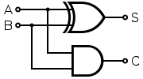
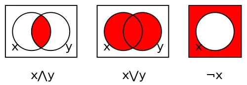

فرمالیسم (Formalism) رویکردی در فلسفهٔ ریاضیات است که ریاضیات را ابزاری متشکل از مجموعه‌ای از قواعد می‌داند؛ ابزاری که در حل مسائل جهان واقعی به کار می‌آید. اصل حاکم بر نظام‌های صوری (Formal Systems) در تقابل با تلقیِ ریاضیاتِ انتزاعی (Abstract Mathematics) قرار دارد. ریاضیات انتزاعی تا قلمروهای بسیار دور از عینیت و واقعیت امتداد می‌یابد؛ برای نمونه، مجموعهٔ مندلبرو (Mandelbrot Set). در مقابل، نظام‌های صوری ماهیتی ذاتاً مصنوع دارند؛ همانند قواعد بازی شطرنج. بر پایهٔ این تمایز، یک ریاضی‌دان ممکن است خود را فرمالیست یا محض‌گرا (Purist) بداند. محض‌گرایان ریاضیات را امری نهفته در طبیعت تلقی می‌کنند که معنا، وجود و زیبایی خود را از همان‌جا می‌گیرد. اما فرمالیست‌ها ریاضیات را صرفاً ابزاری می‌دانند که چیزی بیش از مجموعه‌ای از نمادها برای بازنمایی گزاره‌ها نیست.

در نقطهٔ مقابل این دیدگاه، می‌توان از شهودگرایی (Intuitionism) یاد کرد که شهود و بینش را ابزارهای بنیادین حل مسئله می‌داند.

هرچند فلسفه‌های گوناگونی دربارهٔ ریاضیات وجود دارد، فرمالیسم از اهمیت ویژه‌ای برخوردار است؛ زیرا مبنای شکل‌گیری بسیاری از نظام‌های پیچیده به شمار می‌رود. فرمالیسم با تکیه بر نحو (Syntax) و معناشناسی (Semantics) به صورت‌بندی و حل مسائل می‌پردازد. البته حدود و ثغور نظریه‌های صوری در ریاضیات کاملاً روشن نیست؛ چنان‌که در بحث مربوط به «ناتمامیت‌ها» (Incompletenesses) خواهیم دید. با این همه، نظام‌های صوری از انسجام (Consistency) کافی برخوردارند تا بتوانند بخش قابل توجهی از دستاوردهای مهندسی را در خود جای دهند.

## حقیقت

ما انسان‌ها همواره در برابر این پرسش که «حقیقت چیست؟» دچار حیرت بوده‌ایم. هر دین، مکتب فلسفی و شاخهٔ علمی، آرمانی درخشان را دنبال می‌کند و آن چیزی نیست جز حقیقت. ریاضیات نیز همواره در جست‌وجوی حقیقت بوده است؛ شاید حتی به بیش از یک شیوه.

آیا حقیقت ماهیتی الگوریتمی دارد؟ آیا می‌توان همهٔ پدیده‌های طبیعت را در قالب ریاضیات صورت‌بندی کرد و از این راه به حقیقت دست یافت؟ آیا ریاضیات می‌تواند پدیده‌ای همچون تکامل را تبیین کند؟ شاید روزی چنین شود. اما در این بحث، توجه خود را بر ماهیت ریاضیات متمرکز می‌کنیم.

هدف ما آن است که با بهره‌گیری از ریاضیات، فهم خود از جهان را گسترش دهیم. در حوزهٔ هوش مصنوعی، مسئلهٔ اصلی این است که چگونه می‌توان با اتکا به ریاضیات، فرایند اندیشیدن انسان را بازآفرینی یا شبیه‌سازی کرد. ما در زندگی روزمره پیوسته با مسائلی روبه‌رو هستیم که مستلزم حل مسئله‌اند؛ گاه آگاهانه از شیوهٔ حل آن‌ها آگاهیم و گاه از روی عادت عمل می‌کنیم. برای مثال، افرادی که در خواب راه می‌روند، گاه با دقت شگفت‌انگیزی مسیر خود را در خانه پیدا می‌کنند. این امر ما را به این نتیجه رهنمون می‌شود که دست‌کم بخشی از فرایند اندیشیدن ما ماهیتی الگوریتمی دارد؛ یعنی از دنباله‌ای از گام‌ها پیروی می‌کند تا به نتیجهٔ مطلوب برسد. این‌که چنین فرایند الگوریتمی تا چه اندازه می‌تواند اندیشهٔ انسان را شبیه‌سازی کند، موضوعی است که در ادامهٔ بحث به آن خواهیم پرداخت.

## نظام‌های صوری ریاضی

به‌کارگیری الگوریتم‌ها برای حل مسائل، از دیرباز یکی از دغدغه‌های اصلی ریاضی‌دانانِ فرمالیست بوده است. عصر روشنگری (از اواخر سدهٔ هفدهم تا حدود سال ۱۸۰۰) شاهد شکوفایی منطق بود؛ دانشی که در کانون مباحث مربوط به استدلال و داوری قرار گرفت و در نهایت، به منزلهٔ راهی برای دستیابی به حقیقت تلقی شد. ریاضی‌دانان در پی آن بودند که روش‌هایی قدرتمند بیابند تا بتوان به کمک آن‌ها مسائل را صورت‌بندی و حل کرد. بسیاری از این روش‌ها بر مفهوم مجموعه و نظریهٔ مجموعه‌ها (Set Theory) استوار بودند.

در نظریهٔ مجموعه‌ها، اشیای فیزیکی یا مفاهیم ریاضی به‌صورت «کل» یا «مجموعه» در نظر گرفته می‌شوند؛ به‌گونه‌ای که اعضای یک مجموعه در ویژگی یا خاصیتی مشترک باشند. برای مثال، مجموعهٔ ستارگان. گئورگ کانتور (Georg Cantor) از مهم‌ترین بنیان‌گذاران و توسعه‌دهندگان این نظریه بود. نظریهٔ مجموعه‌ها به اندازه‌ای موفق بود که با اتکا به برهان‌هایی که دربارهٔ مسائل مربوط به جهان واقعی ارائه می‌کرد، اعتبار خود را تثبیت کرد. با این حال، استدلالی از برتراند راسل (Bertrand Russell) کامل بودن نظریهٔ ساده‌انگارانهٔ مجموعه‌ها (Naive Set Theory) را به چالش کشید:

> «\(R\) مجموعهٔ همهٔ مجموعه‌هایی است که عضو خودشان نیستند.»

این تعریف موجب می‌شود که مجموعهٔ \(R\) هم‌زمان هم عضو خودش باشد و هم عضو خودش نباشد؛ زیرا اگر \(R\) عضو خودش نباشد، طبق تعریف باید عضو خودش باشد، و اگر عضو خودش باشد، طبق همان تعریف نباید عضو خودش باشد.

پارادوکس‌هایی مانند پارادوکس راسل، زمینه‌ساز شکل‌گیری نظام‌هایی دقیق‌تر شدند؛ نظام‌هایی که بر مجموعه‌ای مشخص از اصول موضوعه (Axioms) و قواعد استنتاج و رویه‌های عملیاتی استوار بودند و «نظام‌های صوری» (Formal Systems) نام گرفتند. یک فرمالیسم، عملیات منطقی را همان‌گونه توصیف می‌کند که جبر مقدماتی، عملیات عددی را توصیف می‌کند. ایدهٔ بنیادین آن بسیار ساده است:

1. مسئله را با استفاده از زبان نظام صوری و مطابق با نحو (Syntax) آن صورت‌بندی کنید.
2. با تکیه بر اصول موضوعه و قواعد استنتاج و رویه‌های نظام، دربارهٔ درستی یا نادرستی آن استدلال کنید.

برای مثال، منطق گزاره‌ای (Propositional Logic) یکی از نخستین نظام‌هایی است که در چارچوب نظام‌های صوری مطالعه می‌شود. نمونه‌ای ساده از استدلال در منطق گزاره‌ای به صورت زیر است:

- **گزارهٔ ۱:** \(A \Rightarrow B\) (اگر \(A\)، آنگاه \(B\))

- **گزارهٔ ۲:** \(\neg A\) (نقیض \(A\))

- **نتیجه:** \(\neg B\) (نقیض \(B\))

این الگوی استدلال را می‌توان به‌گونه‌ای بر موقعیت‌های جهان واقعی نیز تطبیق داد؛ برای مثال:

- **گزارهٔ ۱:** اگر شب باشد، هوا تاریک است.

- **گزارهٔ ۲:** اکنون شب نیست.

- **نتیجه:** پس هوا تاریک نیست.

که در آن:

- \(A\) و \(B\) متغیرهایی هستند که می‌توانند مقادیر مختلفی بپذیرند.
- \(\Rightarrow\) نماد **استلزام** (Implication) است؛ یعنی درستیِ طرف چپ، درستیِ طرف راست را اقتضا می‌کند.
- \(\neg\) نماد **نقیض** یا **نفی** (Negation) است.

البته، حقیقت در این معنا، نسبت به نظام مورد مطالعه (در اینجا، منطق گزاره‌ای) سنجیده می‌شود. با این حال، نتیجه‌ای که به دست می‌آید، از دل نظامی استنتاج شده است که اعتبار آن پیش‌تر پذیرفته شده است. هرچند می‌توان از منطق‌ها و شیوه‌های استنتاج بسیار پیچیده‌تری نیز استفاده کرد، اما ایدهٔ اساسی همچنان یکسان باقی می‌ماند. نمونه‌ای بسیار ابتدایی از کاربرد یک نظام صوری (منطق گزاره‌ای) در مسائل جهان واقعی را می‌توان در مسئلهٔ «جهان وامپوس» (Wumpus World) مشاهده کرد.

در ادامه، توجه خود را معطوف به **جبر بولی** (Boolean Algebra) خواهیم کرد که شاید پرکاربردترین و شناخته‌شده‌ترین فرمالیسم در منطق ریاضی باشد.

## جبر بولی

منطق گزاره‌ای ارتباطی بسیار نزدیک با جبر بولی (Boolean Algebra) دارد. جبر بولی که امروزه می‌شناسیم، صورت توسعه‌یافته‌ای از دیدگاه‌هایی است که جرج بول (George Boole) در کتاب خود با عنوان «پژوهشی دربارهٔ قوانین اندیشه» (An Investigation of the Laws of Thought) در سال ۱۸۵۴ مطرح کرد. جبر بولی مبنای الکترونیک دیجیتال را تشکیل می‌دهد؛ حوزه‌ای که خود، ستون فقرات محاسبات دیجیتال به شمار می‌رود.

کلود شانون (Claude Shannon) در سال ۱۹۳۷، هنگام مطالعهٔ مدارهای کلیدزنی (Switching Circuits)، دریافت که چگونه می‌تواند قیاس میان منطق بولی و مدارهای گوناگونی را که در حال طراحی آن‌ها بود، برقرار کند. منطق کلیدزنی دوحالتی، یا آنچه امروزه به‌عنوان جبر بولیِ دو عضوی (Two-element Boolean Algebra) می‌شناسیم، از یافته‌های او سرچشمه گرفت.

پیاده‌سازی مدارهای منطقی ترکیبی (Combinational Logic Circuits)، مانند مدار دیجیتال **جمع‌کنندهٔ نیمه‌کامل** (Half Adder)، با استفاده از گیت‌ها (Gates) انجام می‌شود؛ گیت‌هایی که نمونه‌های پایهٔ آن‌ها بر اساس عملگرهای بنیادی بولی تعریف شده‌اند.

\[
S = A \oplus B \quad (A \text{ یا انحصاری } B)
\]

\[
C = A \& B \quad (A \text{ و } B)
\]

نمودارهای ون (Venn Diagrams) برای عملگرهای بنیادی بولی: همبندی (Conjunction)، فصل (Disjunction) و نقیض (Negation).

رایانه‌های دیجیتال امروزی بر پایهٔ جبر بولی دو عضوی بنا شده‌اند.

## منبع

- [Sterin Thalonikkara Jose(2020), **Formal Mathematical Systems**](https://medium.com/@machvolve/formal-mathematical-systems-587f6152a21d)

