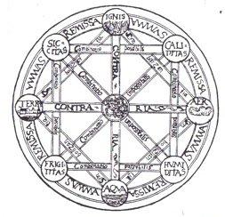

اصطلاح لاتینی Characteristica Universalis که معمولاً در انگلیسی به Universal Characteristic یا Universal Character ترجمه می‌شود، به زبانی صوری و جهان‌شمول اشاره دارد که گوتفرید ویلهلم لایبنیتس آن را در نظر داشت؛ زبانی که بتواند مفاهیم ریاضی، علمی و مابعدالطبیعی را به‌صورت دقیق بیان کند. لایبنیتس امیدوار بود با طراحی چنین زبانی، ابزاری فراهم آورد که بتوان در چارچوب یک محاسبه یا حساب منطقیِ جهان‌شمول (calculus ratiocinator) از آن بهره گرفت.

Characteristica Universalis از مفاهیم تکرارشونده در آثار لایبنیتس است. او هنگام نگارش به زبان فرانسوی، گاه برای اشاره به همین ایده از تعبیر spécieuse générale نیز استفاده می‌کرد. این مفهوم اغلب در کنار ایده calculus ratiocinator (حساب منطقی) و نیز طرح او برای تدوین یک دایرةالمعارف جامع مطرح می‌شود؛ دایرةالمعارفی که قرار بود همه دانش بشری را در قالبی منظم و یکپارچه گرد آورد.

## زبان مشترک جهان

بسیاری از پژوهشگران لایبنیتس که به زبان انگلیسی می‌نویسند، بر این باورند که مقصود او از Characteristica Universalis یا «زبانِ جهان‌شمول» (Universal Character)، نوعی پاسیگرافی (pasigraphy) یا زبان اندیشه‌نگار (ideographic language) بوده است. قرار بود این زبان بر نسخه‌ای عقلانی‌شده از «اصول» نویسه‌های چینی استوار باشد؛ آن‌گونه که اروپاییان در قرن هفدهم این نویسه‌ها را درک می‌کردند. از این منظر، معمولاً Characteristica Universalis با طرح‌های معاصرِ زبان‌های جهان‌شمول، مانند اسپرانتو، زبان‌های کمکی همچون اینترلینگوا (Interlingua)، و نیز پروژه‌های منطق صوری مانند مفهوم‌نگاشت (Begriffsschrift) فرگه مرتبط دانسته می‌شود. افزون بر این، گسترش جهانی تجارت اروپا در عصر لایبنیتس، انگیزه‌هایی مرکانتیلیستی برای ایجاد یک زبان تجاریِ جهان‌شمول پدید آورده بود تا بازرگانان بتوانند، فارغ از زبان طبیعیِ مخاطبان خود، با هم ارتباط برقرار کنند.

با این حال، برخی دیگر از پژوهشگران، از جمله یائنکه (Jaenecke)، خاطرنشان کرده‌اند که لایبنیتس اهداف دیگری نیز برای Characteristica Universalis در نظر داشت و همین جنبه‌ها منشأ ابهام و ناسازگاری یادشده در تفسیرهای جدید از این مفهوم شده‌اند. به گفته یائنکه:

> «پروژه لایبنیتس اساساً پروژه‌ای در منطق نیست، بلکه پروژه‌ای در بازنمایی دانش است؛ حوزه‌ای که در معرفت‌شناسی و فلسفه علمِ معاصر ــ که عمدتاً معطوف به منطق‌اند ــ تا حد زیادی مغفول مانده است. دقیقاً همین جهت‌گیری یک‌سویه این رشته‌هاست که مسئول تصویر تحریف‌شده‌ای از آثار لایبنیتس است که در ادبیات پژوهشی مشاهده می‌شود.»
 
> *— یائنکه، ۱۹۹۶*

همچنین، لویی کوتورا (Louis Couturat) نوشته است که لایبنیتس نظام‌های زبانی جورج دالگارنو (George Dalgarno) و جان ویلکینز (John Wilkins) را از همین حیث مورد انتقاد قرار می‌داد؛ زیرا این نظام‌ها:

> ... بیش از آنکه بر سودمندی علمی متمرکز باشند، معطوف به کاربردهای عملی‌اند؛ یعنی عمدتاً زبان‌های مصنوعی‌ای هستند که برای ارتباطات بین‌المللی طراحی شده‌اند، نه زبان‌های فلسفی‌ای که روابط منطقی میان مفاهیم را بیان کنند. لایبنیتس در مقابل آنها از آنچه خود «مشخصه حقیقی» (real characteristic) می‌نامد دفاع می‌کند؛ زبانی که ترکیب مفاهیم را از طریق ترکیب نشانه‌هایی که عناصر بسیط آنها را بازنمایی می‌کنند، بیان کند، به‌گونه‌ای که تناظر میان مفاهیم مرکب و نمادهای آنها طبیعی باشد، نه صرفاً قراردادی.
 
> *— کوتورا، La Logique de Leibniz، ۱۹۰۱، فصل ۳*

## زبانی جهان‌شمول برای علم

لایبنیتس تصریح می‌کرد که هدف او ایجاد الفبای اندیشه انسانی بود؛ یعنی زبانی نمادین و جهان‌شمول (characteristic) برای علم، ریاضیات و مابعدالطبیعه. به گفته کوتورا:

> در ماه مه ۱۶۷۶، او بار دیگر زبان جهان‌شمول را با characteristic یکی دانست و در رؤیای زبانی بود که در عین حال یک حساب (calculus) نیز باشد؛ نوعی جبر اندیشه.
 
> *— کوتورا، ۱۹۰۱، فصل ۳*

این characteristic در واقع تعمیم و جهان‌شمول‌سازیِ انواع گوناگون «مشخصه‌های حقیقی» (real characteristics) بود. کوتورا می‌نویسد که لایبنیتس هیروگلیف‌های مصری، نویسه‌های چینی و نمادهای شیمیایی را نمونه‌هایی از نظام‌های نگارشی مبتنی بر real characteristics می‌دانست:

> این امر نشان می‌دهد که real characteristic از نظر او نوعی اندیشه‌نگاری (ideography) بود؛ یعنی نظامی از نشانه‌ها که اشیا (یا دقیق‌تر، اندیشه‌ها) را مستقیماً بازنمایی می‌کند، نه واژه‌ها را؛ به‌گونه‌ای که هر ملت بتواند آنها را بخواند و به زبان خود ترجمه کند.»
 
>*— کوتورا، ۱۹۰۱، فصل ۳*

کوتورا در پانویسی بر همین مطلب می‌افزاید:

>لایبنیتس در جایی دیگر حتی نت‌های موسیقی و نمادهای نجومی (نشانه‌های بروج و نشانه‌های سیارات، از جمله خورشید و ماه) را نیز در شمار این گونه نشانه‌ها قرار می‌دهد. همچنین شایان توجه است که لایبنیتس گاه در محاسبات جبری خود، به جای حروف، از نمادهای سیارات استفاده می‌کرد.
 
>*— کوتورا، ۱۹۰۱، فصل ۳*

## مابعدالطبیعه

هارتلی راجرز (Hartley Rogers) با مرتبط ساختن Characteristica Universalis به «نظریه ابتداییِ ترتیب اعداد حقیقی» (elementary theory of the ordering of the reals)، بر بُعد مابعدالطبیعی آن تأکید می‌کند و آن را «نظامی با تعریفی دقیق برای صورت‌بندی گزاره‌های علمی» معرفی می‌کند (راجرز، ۱۹۶۳: ۹۳۴).

پروژه‌های زبان جهان‌شمول، مانند اسپرانتو، و پروژه‌های منطق صوری، مانند مفهوم‌نگاشت (Begriffsschrift) فرگه، معمولاً دغدغه ترکیب معرفت‌شناختی (epistemic synthesis) میان علوم تجربی، ریاضیات، تصویرنگاشت‌ها (pictographs) و مابعدالطبیعه را، آن‌گونه که لایبنیتس توصیف می‌کرد، ندارند. از همین‌رو، پژوهشگران در نشان دادن این‌که چگونه پروژه‌هایی مانند Begriffsschrift یا اسپرانتو می‌توانند تمام چشم‌اندازی را که لایبنیتس برای Characteristica Universalis در نظر داشت، محقق سازند، با دشواری روبه‌رو بوده‌اند.

نوشته‌های الکساندر گوده (Alexander Gode) حاکی از آن است که Characteristica لایبنیتس دارای نوعی گرایش مابعدالطبیعی بوده است که مانع از آن می‌شده تا واقعیت را به‌طور کامل و وفادارانه بازنمایی کند.1 گوده تأکید می‌کند که لایبنیتس ابتدا اهداف یا کارکردهای معینی را تعیین می‌کرد و سپس Characteristica را برای تحقق آن اهداف و کارکردها بسط می‌داد.

## علم
در حوزه علم، لایبنیتس در نظر داشت که Characteristica Universalis او به صورت مجموعه‌ای از نمودارها یا تصاویر درآید که بتوانند هر نظامی را، در هر مقیاسی، بازنمایی کنند و برای همگان، صرف‌نظر از زبان مادری‌شان، قابل فهم باشند. لایبنیتس می‌نویسد:

> و هرچند اهل علم از دیرباز به نوعی زبان یا مشخصه جهان‌شمول اندیشیده‌اند که به‌وسیله آن بتوان همه مفاهیم و اشیا را در نظمی نیکو سامان داد و با یاری آن، ملت‌های مختلف اندیشه‌های خود را با یکدیگر مبادله کنند و هر کس بتواند آنچه را دیگری به زبان خود نوشته است، به زبان خویش بخواند، با این همه، تاکنون هیچ‌کس در پی آن نبوده است که زبانی یا مشخصه‌ای پدید آورد که به‌طور هم‌زمان هم هنر کشف و هم هنر داوری را در بر گیرد؛ یعنی زبانی که نشانه‌ها و علائم آن همان نقشی را ایفا کنند که نشانه‌های حساب برای اعداد و نشانه‌های جبر برای کمیت‌های انتزاعی ایفا می‌کنند. با این حال، به نظر می‌رسد که چون خداوند این دو علم را به بشر عطا کرده است، خواسته ما را آگاه سازد که رازی به‌مراتب بزرگ‌تر در فاهمه ما نهفته است و این دو علم چیزی جز سایه‌هایی از آن راز نیستند.
 
— *لایبنیتس، Zur allgemeinen Charakteristik، در: Hauptschriften zur Grundlegung der Philosophie، Philosophische Werke، جلد ۱، صص. ۳۰–۳۱. ترجمه آرتور بوخناو، با بازبینی، مقدمه و یادداشت‌های ارنست کاسیرر. هامبورگ: انتشارات فلیکس ماینر، ۱۹۶۶. (مگر آنکه خلاف آن تصریح شده باشد، همه نقل‌قول‌های لایبنیتس از رساله درباره مشخصه جهان‌شمول (On the General Characteristic) است، آن‌گونه که در ترجمه لوِمکر (۱۹۶۹: ۲۲۱–۲۲۵) آمده است. این نقل‌قول از صفحه ۲۲۲ است.)*

پی. پی. واینر (P. P. Weiner) نمونه‌ای از کاربرد گسترده Characteristicaی لایبنیتس را در علم اقلیم‌شناسی مطرح کرده است. او می‌نویسد که دستگاه پیش‌بینی آب‌وهوا که آتاناسیوس کیرخر (Athanasius Kircher) ابداع کرده بود، «از آن جهت برای لایبنیتس جالب توجه بود که با تلاش‌های خود او برای ابداع یک زبان جهان‌شمول ارتباط داشت» (واینر، ۱۹۴۰).

لایبنیتس در همان آغاز دوران علمی خود، رؤیای خویش درباره یک زبان علمی جهان‌شمول را چنین بیان کرده است:

> ما درباره هنر ترکیب علوم، یعنی منطق اکتشافی، سخن گفته‌ایم... اما هنگامی که جدول‌های مقولاتِ هنر ترکیب ما تدوین شوند، چیزی بزرگ‌تر پدید خواهد آمد. زیرا اگر اصطلاحات نخستین، که همه اصطلاحات دیگر از ترکیب آنها ساخته می‌شوند، با نشانه‌هایی مشخص شوند، این نشانه‌ها نوعی الفبا خواهند بود. شایسته است که این نشانه‌ها تا حد امکان طبیعی باشند؛ برای مثال، برای واحد یک نقطه، برای اعداد مجموعه‌ای از نقطه‌ها، برای روابط میان یک موجود و موجودی دیگر خط‌ها، و برای تغییرات زاویه‌ها و انتهای خط‌ها، گونه‌های مختلفی از روابط. اگر این امور به‌درستی و با مهارت سامان یابند، این نگارش جهان‌شمول به همان اندازه که همگانی است، آسان نیز خواهد بود و بدون هیچ فرهنگ لغتی قابل خواندن خواهد بود؛ و در عین حال، شناختی بنیادین از همه اشیا به دست خواهد داد. تمام این نظام نوشتاری، به‌نوعی، از شکل‌های هندسی و گونه‌ای از تصاویر تشکیل خواهد شد؛ همان‌گونه که مصریان باستان چنین می‌کردند و چینیان نیز امروز چنین می‌کنند. البته تصاویر آنان به یک الفبای ثابت فروکاسته نشده‌اند... و در نتیجه، به حافظه‌ای بسیار نیرومند نیاز دارند؛ چیزی که دقیقاً برخلاف مقصود ماست.
 
— *درباره هنر ترکیب (On the Art of Combination)، ۱۶۶۶، ترجمه‌شده در پارکینسون، ۱۹۶۶: صص. ۱۰–۱۱.*

نیکلاس رشر (Nicholas Rescher) در بررسی مقاله کوهن (۱۹۵۴) می‌نویسد:

>برنامه لایبنیتس برای یک علم جهان‌شمول (scientia universalis)، که هدف آن سازمان‌دهی همه معارف بشری در قالب یک کلّ نظام‌مند بود، از دو بخش تشکیل می‌شد: (۱) یک نمادگذاری جهان‌شمول (characteristica universalis) که به‌وسیله آن هر نوع اطلاعاتی بتواند به شیوه‌ای طبیعی و نظام‌مند ثبت شود؛ و (۲) روشی برای پردازش محاسباتیِ دانشی که بدین‌گونه ثبت شده است، به‌منظور آشکار ساختن روابط منطقی و نتایج مترتب بر آن (calculus ratiocinator).
— *رشر، ۱۹۵۴.*

لایبنیتس در سال‌های پایانی عمر خود نوشت که ترکیب مابعدالطبیعه با ریاضیات و علم، از طریق یک مشخصه جهان‌شمول، مستلزم ایجاد چیزی است که خود آن را چنین توصیف می‌کند:

>... نوعی جبر عمومی که در آن همه حقایق عقل به گونه‌ای از حساب فروکاسته شوند. در عین حال، این نظام نوعی زبان یا نگارش جهان‌شمول نیز خواهد بود؛ اما به‌کلی متفاوت از همه زبان‌هایی که تاکنون پیشنهاد شده‌اند. زیرا خودِ نشانه‌ها و واژه‌ها ذهن را هدایت خواهند کرد و خطاها ــ جز خطاهای مربوط به واقع ــ صرفاً خطاهای محاسباتی خواهند بود. پدید آوردن یا ابداع چنین زبان یا مشخصه‌ای بسیار دشوار خواهد بود، اما آموختن آن، بدون نیاز به هیچ فرهنگ لغتی، بسیار آسان خواهد بود.
 
— *لایبنیتس، نامه به نیکولا رمون (Nicolas Remond)، ۱۰ ژانویه ۱۷۱۴، در: لوِمکر، ۱۹۶۹: ص. ۶۵۴. ترجمه با اندکی بازنگری.*

بنابراین، این بازنمایی جهان‌شمولِ دانش، قرار بود خط‌ها، نقطه‌ها و گونه‌ای از تصاویر (pictographs یا logograms) را با یکدیگر ترکیب کند؛ عناصری که سپس به‌وسیله calculus ratiocinator مورد پردازش قرار می‌گرفتند. لایبنیتس امیدوار بود که جبر تصویری او بتواند مطالعه علمیِ پدیده‌های کیفی را پیش ببرد و بدین‌ترتیب همان چیزی را پدید آورد که خود از آن با عنوان:

> آن علمی که در آن صورت‌ها یا فرمول‌های اشیا به‌طور کلی، یعنی کیفیت به‌طور کلی، مورد بررسی قرار می‌گیرند.

یاد می‌کند.

## استدلال نموداری او

از آنجا که Characteristica Universalis ماهیتی نموداری (diagrammatic) دارد و از تصویرنگاشت‌ها (pictograms) بهره می‌گیرد (نگاه کنید به شکل)، نمودارهایی که در آثار لایبنیتس آمده‌اند، شایسته بررسی دقیق هستند. لایبنیتس دست‌کم در دو مورد، استدلال‌های فلسفی خود را با استفاده از نمودارها به تصویر کشیده است. یکی از این نمودارها، تصویر آغازین (frontispiece) کتاب De Arte Combinatoria (درباره هنر ترکیب، ۱۶۶۶) است که نظریه ارسطوییِ چگونگی شکل‌گیری همه اشیای مادی از ترکیب چهار عنصر خاک، آب، هوا و آتش را بازنمایی می‌کند.

چهار عنصر یادشده چهار گوشه یک لوزی را تشکیل می‌دهند (نگاه کنید به شکل). زوج‌های متقابلِ این عناصر با نواری که بر آن واژه «متضادها» (contraries) نوشته شده است، به یکدیگر متصل شده‌اند (خاک–هوا و آتش–آب). در چهار گوشه مربعِ منطبق بر این لوزی نیز چهار کیفیت تشکیل‌دهنده عناصر قرار گرفته‌اند. هر دو کیفیت مجاور با نواری که بر آن عبارت «ترکیب ممکن» (possible combination) نوشته شده، به هم متصل شده‌اند؛ در مقابل، قطرهایی که این کیفیت‌ها را به یکدیگر وصل می‌کنند، با عبارت «ترکیب ناممکن» (impossible combination) مشخص شده‌اند.

اگر از رأس بالایی شکل آغاز کنیم، آتش از ترکیب خشکی و گرمی پدید می‌آید؛ هوا از تری و گرمی؛ آب از سردی و تری؛ و خاک از سردی و خشکی.

## بازنگری لایبنیتس در اندیشه خود

لایبنیتس به‌درستی دریافته بود که ایجاد Characteristica Universalis کاری بسیار دشوار است. او زمانی را که برای تدوین آن لازم می‌دانست چنین برآورد کرده بود:

> گمان می‌کنم گروهی از افراد برگزیده بتوانند این کار را در مدت پنج سال به انجام برسانند.
 
*— لوِمکر، ۱۹۶۹: ص. ۲۲۴*

او سپس می‌افزاید:

> ازاین‌رو، بار دیگر همان سخنی را تکرار می‌کنم که بارها گفته‌ام: انسانی که نه پیامبر باشد و نه پادشاه، هرگز نمی‌تواند کاری بزرگ‌تر، سودمندتر برای نوع بشر و شایسته‌تر برای جلال الهی از این را بر عهده گیرد.
 
*— لوِمکر، ۱۹۶۹: ص. ۲۲۵*

با این حال، در سال‌های پایانی زندگی، لحن او واقع‌بینانه‌تر و محتاطانه‌تر شد. او در نامه‌ای به تاریخ مارس ۱۷۰۶ به الکتریس سوفیِ هانوفر (Electress Sophia of Hanover)، همسر حامی خود، چنین نوشت:

> درست است که در گذشته در اندیشه ابداع شیوه جدیدی برای محاسبه بودم که برای موضوعاتی مناسب باشد که هیچ وجه اشتراکی با ریاضیات ندارند؛ و اگر این نوع منطق به کار گرفته می‌شد، هر نوع استدلال، حتی استدلال‌های احتمالی، همانند استدلال‌های ریاضی می‌بود. در آن صورت، اگر لازم می‌شد، ذهن‌های کم‌توان‌تر، به شرط آنکه پشتکار و حسن نیت داشته باشند، اگر نمی‌توانستند همگام با بزرگ‌ترین اندیشمندان حرکت کنند، دست‌کم قادر بودند از آنان پیروی کنند. زیرا همیشه می‌شد گفت: بیایید محاسبه کنیم، و بر پایه آن، تا آنجا که داده‌ها و عقل ابزار لازم را در اختیار ما می‌گذارند، به‌درستی داوری کنیم. اما نمی‌دانم آیا هرگز در موقعیتی خواهم بود که چنین طرحی را به انجام برسانم؛ طرحی که به بیش از یک دست نیاز دارد. افزون بر این، به نظر می‌رسد که نوع بشر هنوز به آن درجه از بلوغ نرسیده است که بتواند مدعی بهره‌مندی از مزایایی باشد که این روش می‌تواند فراهم آورد.
 
*— استریکلند، ۲۰۱۱: ص. ۳۵۵*

او در نامه‌ای دیگر، در سال ۱۷۱۴، خطاب به نیکولا رمون (Nicholas Remond)، نوشت:

> درباره جبر عمومی خود با مارکی دو لوپیتال و دیگران سخن گفته‌ام، اما آنان بیش از آنکه گویی خواب و خیالی از من شنیده باشند، به آن توجهی نکردند. البته می‌بایست آن را با نمونه‌ای آشکار پشتیبانی می‌کردم؛ اما برای این کار لازم بود دست‌کم بخشی از مشخصه (characteristic) خود را تدوین کنم، و این کاری آسان نیست؛ به‌ویژه در وضع کنونی من و بدون آنکه از گفت‌وگو با کسانی بهره‌مند باشم که بتوانند در چنین کاری مرا برانگیزند و یاری رسانند.
 
> *لوِمکر، ۱۹۶۹: ص. ۶۵۶*

سرانجام، لایبنیتس با آشنایی دوباره با دستگاه اعداد دودویی (binary digits) از طریق متون چینی، به‌ویژه ای چینگ (I Ching)، به این باور رسید که پیوندی بنیادین را کشف کرده است؛ پیوندی که به گمان او می‌توانست مبنای تحقق Characteristica Universalis باشد. بر پایه این دیدگاه، این کشف بعدها به شکل‌گیری بنیان‌های منطق نمادین و فلسفه جدید، به‌ویژه فلسفه تحلیلی مبتنی بر منطق محمولات (predicate-based Analytic Philosophy) و منطق بولی (Boolean Logic) انجامید.

## سه معیار

سی. جی. کوهن (C. J. Cohen) در سال ۱۹۵۴ سه معیار را مطرح کرد که هر پروژه‌ای برای ایجاد یک زبان فلسفی باید آنها را برآورده سازد تا بتوان آن را نمونه‌ای از Characteristica Universalis به شمار آورد. کوهن در بیان این معیارها به مفهوم «لوجیستیک» (logistic) ارجاع می‌دهد. مقصود او از این اصطلاح، همان معنایی نیست که امروزه در تحلیل‌های آماری از واژه logistic مراد می‌شود.

در سال ۱۹۱۸، کلارنس اروینگ لوئیس (Clarence Irving Lewis)، نخستین منطق‌دان انگلیسی‌زبانی که بخشی از نوشته‌های منطقی لایبنیتس را ترجمه و بررسی کرد، مفهوم لوجیستیک را چنین توضیح می‌دهد:

> لوجیستیک را می‌توان علمی دانست که به انواع نظم، از آن حیث که نظم‌اند، می‌پردازد. لوجیستیک بیش از آنکه یک موضوع باشد، یک روش است. هرچند بخش عمده‌ای از لوجیستیک یا بر اصول منطق نمادین استوار است یا استفاده گسترده‌ای از آنها می‌کند، بااین‌حال، علمِ نظم به‌طور کلی، لزوماً منطق نمادین را پیش‌فرض نمی‌گیرد و نقطه آغاز خود نیز قرار نمی‌دهد.
 
*— لوئیس، ۱۹۶۰: صص. ۳، ۷–۹. (لوئیس در اینجا اندیشه‌های استاد خود، جوزایا رویس (Josiah Royce)، را بازتاب می‌دهد؛ نک.: مدخل «Order» در Collected Logical Writings of Royce، چاپ ۱۹۵۱.)*

بر این اساس، کوهن نتیجه می‌گیرد که مشخصه جهان‌شمول (universal character) باید سه کارکرد اساسی زیر را داشته باشد:

1. یک زبان کمکی بین‌المللی (international auxiliary language) باشد که افرادِ دارای زبان‌های مادری متفاوت بتوانند به‌وسیله آن با یکدیگر ارتباط برقرار کنند.

2. دستگاهی نمادین برای بیان دقیق و نظام‌مندِ تمام دانش موجود فراهم آورد، به‌گونه‌ای که امکان یک پردازش لوجیستیکی (logistic treatment) از علم، به‌طور کلی، فراهم شود. افزون بر این، این دستگاه نمادین باید قابلیت گسترش برای دربرگرفتن دانش‌های آینده را نیز داشته باشد.

3. ابزاری برای کشف و اثبات (instrument of discovery and demonstration) باشد.

این سه معیار، همراه با مفهوم لوجیستیک، نشان می‌دهند که کوهن و لوئیس هر دو Characteristica Universalis را با روش‌ها و اهداف نظریه عمومی سیستم‌ها (General Systems Theory) مرتبط می‌دانسته‌اند.

## یک زبان علمی مشترک

ناسازگاری، ابهام و فقدان جزئیات کافی در ترجمه‌های انگلیسی‌زبان از نوشته‌های لایبنیتس و نیز در تفسیرهای جدید انگلیسی‌زبان از آثار او، ارائه توضیحی روشن و دقیق را دشوار می‌سازد. همانند calculus ratiocinator لایبنیتس، دو جریان متفاوت در اندیشه فلسفی، بر دو جنبه متفاوتی که در نوشته‌های لایبنیتس یافت می‌شود، تأکید کرده‌اند.

دیدگاه نخست بر منطق و زبان تأکید می‌کند و با فلسفه تحلیلی و خردگرایی (rationalism) پیوند دارد. دیدگاه دوم بیشتر با دیدگاه‌های کوتورا، آن‌گونه که در بالا بیان شد، هماهنگ است؛ زیرا بر علم و مهندسی تأکید می‌کند. این دیدگاه با فلسفه ترکیبی (synthetic philosophy) و تجربه‌گرایی (empiricism) مرتبط دانسته می‌شود.

لایبنیتس امیدوار بود که یکی یا هر دوِ این جنبه‌ها بتوانند همچون رشته آریادنه (Ariadne's thread) راهنمای استدلال انسانی باشند و از این طریق، راه‌حل‌هایی برای بسیاری از مسائل فوری و اساسی بشریت پیشنهاد کنند.

## گودل: توطئه ای در کار است!

از آنجا که لایبنیتس هرگز Characteristica Universalis را با جزئیات عملیاتی و اجرایی توصیف نکرد، بسیاری از فیلسوفان آن را خیالی بی‌اساس و غیرواقع‌بینانه دانسته‌اند. در همین راستا، پارکینسون می‌نویسد:

> دیدگاه‌های لایبنیتس درباره ماهیت نظام‌مندِ تمام دانش‌ها، با طرح‌های او برای یک نمادگذاری جهان‌شمول، یعنی Characteristica Universalis، پیوند دارد. این نظام قرار بود حسابی باشد که تمام اندیشه را دربرگیرد و مناقشه و اختلاف را با محاسبه جایگزین کند. این آرمان، امروزه بیش از حد خوش‌بینانه و حتی مضحک به نظر می‌رسد...»
 
*— پارکینسون، ۱۹۷۳: ص. ix*

از سوی دیگر، منطق‌دان کورت گودل (Kurt Gödel) باور داشت که Characteristica Universalis امکان‌پذیر است و تحقق آن می‌توانست شیوه عمل در ریاضیات را دگرگون کند (داوسون، ۱۹۹۷). با این حال، او متوجه شد که پرداختن دقیق و مفصل به این طرح در نوشته‌های منتشرشده لایبنیتس، به‌طرز چشمگیری غایب است.

به نظر می‌رسد گودل همه متون لایبنیتس را که در آنها اشاره‌ای به Characteristica شده بود، گردآوری کرد و خود را متقاعد ساخت که نوعی سانسور سازمان‌یافته و توطئه‌آمیز درباره این طرح رخ داده است؛ باوری که به تدریج به نوعی وسواس تبدیل شد.

ممکن است گودل از بزرگیِ کاری که در برابر ویراستاران دست‌نوشته‌های لایبنیتس قرار داشت، به اندازه کافی آگاه نبوده باشد؛ زیرا لایبنیتس حدود ۱۵٬۰۰۰ نامه و ۴۰٬۰۰۰ صفحه دست‌نوشته دیگر از خود برجای گذاشت. حتی امروزه نیز بخش عمده‌ای از این میراث عظیم (Nachlass) همچنان منتشر نشده باقی مانده است.

## پروژه‌های مرتبط در قرن هفدهم میلادی

افراد دیگری در قرن هفدهم، مانند جورج دالگارنو (George Dalgarno)، پروژه‌های فلسفی و زبانی مشابهی را دنبال کردند که برخی از آنها تحت عنوان ماتسیس جهان‌شمول (mathesis universalis) مطرح می‌شدند. نمونه برجسته این جریان، جان ویلکینز (John Wilkins)، نویسنده کتاب An Essay towards a Real Character and a Philosophical Language، بود که به‌عنوان نخستین گام در مسیر ایجاد یک زبان جهان‌شمول، یک تزاروس (thesaurus) تألیف کرد.

او قصد داشت به این تزاروس، یک الفبای اندیشه انسانی (alphabet of human thought) ــ یعنی یک طرح سازمان‌دهی شبیه به تزاروس یا نظام دهدهی دیویی ــ و نیز یک «جبر اندیشه» (algebra of thought) بیفزاید که امکان دست‌کاری و پردازش بر اساس قواعد را فراهم کند.

فیلسوفان و زبان‌شناسانی که چنین پروژه‌هایی را دنبال می‌کردند، اغلب به گروه‌های طرفدار پان‌سوفیا (pansophical) ــ یعنی دانش جهان‌شمول (universal knowledge) ــ و گروه‌های فعال در حوزه دانش علمی در لندن و آکسفورد تعلق داشتند. این گروه‌ها در مجموع با عنوان «کالج نامرئی» (Invisible College) شناخته می‌شدند و امروزه از آنان به‌عنوان پیشگامان شکل‌گیری انجمن سلطنتی (Royal Society) یاد می‌شود.

## پروژه‌های معاصر

در طول ۱۵۰ سال گذشته، طیف گسترده‌ای از زبان‌های ساخته‌شده پدید آمده‌اند که می‌توان آنها را در برخی جنبه‌ها مؤید برخی از شهودهای لایبنیتس دانست.

- **ریموند اف. پایپر** (*Raymond F. Piper*) (۱۹۵۷: ۴۳۲–۴۳۳) ادعا کرد که اثر **نمادگذاری یکپارچه برای فهم جهانی در علم** (*Unified Symbolism for World Understanding in Science*) نوشته **او. ال. رایزر** (*O. L. Reiser*) (۱۹۵۵)، که بسطی از اثر او با عنوان **فلسفه‌ای برای وحدت جهانی** (*A Philosophy for World Unification*) (۱۹۴۶) بود، از **Characteristica Universalis** لایبنیتس الهام گرفته است. او این نظام را برای فهم جهانی و ارتباطات بدون سوگیری ضروری می‌دانست تا «جنگ سرانجام بتواند از میان برود و یک سازمان جهانی از انسان‌های صلح‌طلب به‌تدریج شکل گیرد» (پایپر، همان).

- مطالعه جبر بولی جبرهای بولی و نظریه گروه‌ها در قرن نوزدهم، شهود لایبنیتس را تأیید کرد که جبر مجرد روش‌های جبری می‌توانند برای استدلال درباره پدیده‌های کیفی و غیرعددی به کار روند. به‌طور خاص، اعضای مجموعه جهانی یک جبر بولی یا گروه (ریاضیات) گروه لزوماً نباید عدد باشند. افزون بر این، بخش قابل توجهی از فلسفه و علم نظری را می‌توان به صورت نظریه‌های اصل‌موضوعی (*axiomatic theories*) مبتنی بر منطق مرتبه اول و نظریه مجموعه‌ها صورت‌بندی کرد.

 همچنین باید توجه داشت که نظریه مدل برای صورت‌بندی و استدلال درباره موضوعاتی کاملاً غیرعددی، مانند معناشناسی و کاربردشناسی زبان‌های طبیعی، به کار گرفته شده است. با این حال، این رویکردها تاکنون به هیچ‌گونه تصویرنگاشت نمادگذاری تصویرنگارانه منجر نشده‌اند.

- **فیرنلی-ساندر** (*Fearnley-Sander*) (۱۹۸۶) یک گام فراتر رفت و **characteristica**ی لایبنیتس را ترکیبی از **جبر منطق** (*algebra of logic*) ــ که فیرنلی-ساندر آن را **calculus ratiocinator** تعریف می‌کند ــ و **جبر هندسه** (*algebra of geometry*) ــ که آن را **characteristica geometrica** می‌نامد ــ دانست. فیرنلی-ساندر پیشنهاد کرد که این ترکیب با ظهور جبر جهان‌شمول «تحقق یافته است». برخی دیگر از پژوهشگران حوزه «جبر جهان‌شمول» ــ یعنی مطالعه ویژگی‌های ریاضی و منطقی ساختارهای جبری به‌طور کلی ــ باور ندارند که جبر جهان‌شمول ارتباطی با **characteristica** داشته باشد.

- **پالکو، گی بولچسو** (*Palko, Gy Bulcsu*) (۱۹۸۶) تحلیل ساختاری را برای تحلیل و طراحی نظام‌های سلسله‌مراتبی با استفاده از یک زبان شمایلی بررسی کرد و پیشنهاد داد که این امر کاربردی از مشخصه جهان‌شمول پروژه لایبنیتس در زبان تحلیل ساختاری و صورت‌بندی یک نظام کنترل شمایلی است.

- **کلوگه** (*Kluge*) (۱۹۸۰) استدلال کرد که اثر بنیادین گوتلوب فرگه فرگه ، یعنی Begriffsschrift ، آگاهانه از **characteristica universalis** الهام گرفته است.

- با وجود اینکه چارلز سندرز پیرس ، یکی از بنیان‌گذاران نشانه‌شناسی ، باور داشت که تمام استدلال‌ها ماهیتی نموداری دارند، رابطه احتمالی میان **characteristica** و نمودارهای وجودی او و نیز نشانه‌شناسی، هنوز در ادبیات انگلیسی بررسی نشده است.

- چندین جنبه از پوزیتیویسم منطقی ، به‌ویژه:

 - نظریه‌های مرتبه اول رودلف کارناپ در کتاب *Aufbau* (۱۹۲۸، ترجمه انگلیسی ۱۹۶۷) و اثر پس از آن، یعنی گودمن (۱۹۷۷)، از نظر گستره و بلندپروازی، ماهیتی لایبنیتسی دارند؛ هرچند لایبنیتس احتمالاً با دشمنی آشکار کارناپ نسبت به همه مابعدالطبیعه مخالفت می‌کرد.

 - جنبش وحدت علم در دهه ۱۹۳۰، که توسط اوتو نویرات ، رودلف کارناپ و چارلز دبلیو. موریس رهبری شد و بعدها ادوارد هاسکل و دیگران نیز در آن مشارکت داشتند، قابل مقایسه با **characteristica** است.

 - نظام تصویرنگاری ایزوتایپ اوتو نویرات و «زبان تصویری بین‌المللی».

- تلاش‌های زیر برای بازسازی بخش‌هایی از علم نظری به صورت نظریه‌های اصل‌موضوعی مرتبه اول را می‌توان تلاش‌هایی برای توسعه بخش‌هایی از **characteristica** دانست:

 - **نسبیت خاص**، توسط هانس رایشنباخ ، رودلف کارناپ و دیگران در دهه ۱۹۲۰ (کارناپ، ۱۹۵۸: ۱۹۷–۲۱۲).

 - **زیست‌شناسی**، توسط جوزف وودگر (۱۹۳۷)، در دهه ۱۹۳۰ (کارناپ، ۱۹۵۸: ۲۱۳–۲۲۰).

 - **مکانیک**، توسط ساپس (۱۹۵۷: ۲۹۱–۳۰۵) و دیگران در دهه ۱۹۵۰.

- اهداف پروژه **Symbolator** یا «رایانه ایده» (*idea-computer*) (گوپولد، ۱۹۹۴) از برخی جهات به نسخه‌ای کم‌جاه‌طلبانه‌تر از **characteristica universalis** شباهت دارد.

- ارتباط‌هایی میان این پروژه و فرقه یهودی کابالا و نیز سیاست زبان کمکی بین‌المللی آیین بهائی مطرح شده است.

- همچنین ادعا شده است که **characteristic** نیای زبان نظام‌های انرژی تصویرنگارانه و سنتز امرژی مرتبط با بوم‌شناسی نظام‌ها بوم‌شناسی نظام‌های هاوارد تی. اودوم است (Cevolatti and Maud, 2004).

 زبان نظام‌های انرژی، خط‌ها و نقطه‌ها را با «گونه‌ای از تصاویر» ترکیب می‌کند که به‌وسیله رایانه‌های دیجیتال و بسته‌های نرم‌افزاری مانند EXTEND (Odum, Odum, and Peterson 1995) و شبیه‌ساز امرژی والی (*Valyi's Emergy Simulator*) دست‌کاری می‌شوند.

 این زبان برای ایجاد یک زبان عمومی نظام‌ها طراحی شد که امکان حسابداری کمی و شبیه‌سازی ریاضی روابط کیفی انرژی میان موجودات بوم‌شناختی را فراهم آورد:

 > آن علمی که در آن صورت‌ها یا فرمول‌های اشیا به‌طور کلی، یعنی کیفیت به‌طور کلی، مورد بررسی قرار می‌گیرند.

 از استفاده مکرر از این زبان در مدل‌سازی و شبیه‌سازی اصول انرژی روابط بوم‌شناختی، یک جبر عمومی با نام جبر امرژی (*emergy algebra*) پدید آمد. این جبر به‌ویژه امکان کشف و اثبات اصل بیشینه توان را فراهم کرد که به‌عنوان قانون چهارم ترمودینامیک پیشنهاد شده است.

 اگر این ادعای تبارشناختی پذیرفته شود، نرم‌افزارهای شبیه‌سازی مانند EXTEND و شبیه‌ساز امرژی والی را می‌توان ترکیبی از **characteristica** و calculus ratiocinator دانست؛ البته تنها در صورتی که رایانه دیجیتال به‌عنوان تجسم فیزیکی **calculus ratiocinator** تفسیر شود.

- کارهای ماریو بانگه در مرز میان فیزیک و مابعدالطبیعه، ظاهراً بر پیش‌فرض‌های مابعدالطبیعی مشابه با پیش‌فرض‌های **characteristica**ی لایبنیتس استوار است (Radnitzky 1981: 246).

- جبر متعالی جبر متعالی (*Transcendent Algebra*) اثر یاکوب لینتسباخ ، که نوعی پاسیگرافی برای امکان «محاسبه حقیقت» از طریق دست‌کاری واقعیت‌های داده‌شده بر اساس اصولی مشابه اصول ریاضی بود، از **characteristica**ی لایبنیتس الهام گرفته است.

- لوجبان (*Lojban*) (و نسخه قدیمی‌تر آن لوگلان Loglan ) هر دو زبان‌های مصنوعی مشتق‌شده از منطق محمولات هستند و برای استفاده در ارتباطات انسانی طراحی شده‌اند.

- نمادهای بلیس (*Blissymbols* یا *Blissymbolics*) اثر چارلز کی. بلیس ، که امروزه به‌عنوان «زبان جایگزین و افزوده» برای افراد دارای معلولیت استفاده می‌شود، اما در اصل به‌عنوان یک زبان کمکی بین‌المللی طراحی شده بود، گفته شده است که در چارچوب **characteristica** قرار می‌گیرد (Bliss 1978).

- ایموجی ‌ها، با وجود آنکه هنوز در مراحل ابتدایی خود هستند، می‌توانند مرحله‌ای اولیه از توسعه طبیعی یک زبان لوگوگرافیک جهان‌شمول تلقی شوند.

- ایتکویل (*Ithkuil*) زبان ساخته‌شده‌ای است که توسط جان کوییادا ایجاد شده و برای بیان سطوح عمیق‌تر شناخت انسانی به‌صورت کوتاه، آشکار و روشن طراحی شده است؛ به‌ویژه در ارتباط با دسته‌بندی‌های انسانی.

- سازمان بین‌المللی استانداردسازی (*ISO*)، با پیشینه‌ای که به دهه ۱۹۲۰ بازمی‌گردد، در سال ۱۹۴۷ با نام کنونی خود به‌عنوان سازمانی غیردولتی با جایگاه مشورتی عمومی نزد شورای اقتصادی و اجتماعی سازمان ملل متحد تأسیس شد. اعضای آن شامل نهادهای ملی استانداردسازی ۱۶۴ کشور عضو سازمان ملل هستند. ایزو بر اساس فعالیت بیش از ۲۵۰ کمیته فنی خود، بیش از ۲۰٬۰۰۰ استاندارد برای اصطلاحات علمی، نام‌ها و اختصارات، وزن‌ها و اندازه‌ها و تصویرنگاشت‌های مرتبط با ایمنی و حوزه‌های دیگر منتشر کرده است.

- زبان مدل‌سازی یکپارچه (*Unified Modeling Language - UML*) یک زبان مدل‌سازی عمومی در حوزه مهندسی نرم‌افزار است که هدف آن ارائه روشی استاندارد برای نمایش بصری طراحی یک نظام است.

- **Bennett, John G.; Bortoft, Henri; and Pledge, Kenneth**:
 «به سوی یک زبان کامل از نظر عینی: مقاله‌ای در توصیف عینی به‌کاررفته در روش علمی»
 
 *Systematics: The Journal of the Institute for the Comparative Study of History, Philosophy and the Sciences*،
 جلد ۳، شماره ۳، دسامبر ۱۹۶۵، صفحات ۱۸۵–۲۲۹.

- الفبای آوایی بین‌المللی (*International Phonetic Alphabet - IPA*) نظامی الفبایی برای نشانه‌گذاری آوایی است که عمدتاً بر اساس خط لاتین ساخته شده است. این نظام در اواخر قرن نوزدهم توسط انجمن آوایی بین‌المللی طراحی شد تا بازنمایی استانداردی از صداهای زبان گفتاری فراهم آورد.

## منابع

* "Isotype and FUTURE books - Neurath". June 2003. Retrieved 10 July 2016.
* "Emergy Simulator". SourceForge.net. 16 April 2013. Retrieved 10 July 2016.
On Leibniz's lifelong interest in the characteristica and the like, see the following texts in Loemker (1969): 165–66, 192–95, 221–28, 248–50, and 654–66.

On the characteristica, see Rutherford (1995) and the still-classic discussion in Couturat (1901: chpts. 3,4). Also relevant to the characteristica is Mates's (1986: 183–88) discussion of what he called the lingua philosophica.

* Bliss, Charles K., 1978. Semantography: Blissymbolics. 3rd enlarged edition. Sydney: Semantography-Blissymbolics Publications.
* Brown, M. T., 2004. "A picture is worth a thousand words: energy systems language and simulation," Ecological Modelling 178: 83–100.
* Bulcsu P. G., 1986. "Formalization of the Iconic Language for Structured Analysis and Symbolic Logic," [A STRUKTURALT ANALIZIS (SA) IKONIKUS NYELVENEK FORMALIZALASA ES A SZIMBOLIKUS LOGIKA.] Meres es Automatika 34: 315–22.
* Carnap, Rudolph, 1958. Introduction to Symbolic Logic with Applications. Dover.
* —, 1967. The Logical Structure of the World: Pseudoproblems in Philosophy. University of California Press. Translation of his 1928 Der Logische Aufbau der Welt. Leipzig: Felix Meiner Verlag.
* Cevolatti, D., and Maud, S., 2004. "Realising the Enlightenment: H. T. Odum's Energy Systems Language qua G. W. v. Leibniz's Characteristica Universalis", Ecological Modelling 178: 279–92.
* Cohen, C. Jonathan, 1954. "On the project of a universal character," Mind (New Series) 63: 249, pp. 49–63.
* Couturat, Louis, 1901. La Logique de Leibniz. Paris: Felix Alcan. (Donald Rutherford's English translation in progress.)
* Couturat, Louis, O. Jespersen, R. Lorenz, Wilhelm Ostwald and L. Pfaundler, 1910. International Language and Science: Considerations on the Introduction of an International Language into Science, Constable and Company Limited, London.
* Dascal, M., 1987. Leibniz: Language, Signs and Thought, A Collection of Essays. Philadelphia: John Benjamins.
* Davis, Martin, 2001. Engines of Logic: Mathematicians and the Origin of the Computer. W W Norton.
* Dawson, Jr., J. W., 1997. Logical Dilemmas: The Life and Work of Kurt Gödel. Wellesley MA: A. K. Peters.
* Fearnley-Sander, Desmond, 1982. "Hermann Grassmann and the Prehistory of Universal Algebra," The American Mathematical Monthly 89: 161–66.
* Gode, Alexander, 1951. Interlingua-English: A Dictionary of the International language. New York: Storm Publishers.
* Goodman, Nelson, 1977 (1951). The Structure of Appearance. Reidel.
* Hintikka, Jaakko, 1997. Lingua Universalis vs. Calculus Ratiocinator. An ultimate presupposition of Twentieth-century philosophy. Kluwer.
* Jaenecke, P., 1996. "Elementary principles for representing knowledge," Knowledge Organization 23: 88–102.
* Kluge, E. H. W., 1980. "Frege, Leibniz and the notion of an ideal language," Studia Leibnitiana 12: 140–54.
* Lewis, C. I., 1960 (1918). A Survey of Symbolic Logic. Dover.
* Loemker, Leroy, ed. and trans., 1969. Leibniz: Philosophical Papers and Letters. Synthese Historical Library. Dordrecht: D. Reidel.
* Mates, Benson, 1986. The Philosophy of Leibniz. Oxford Univ. Press.
* Odum, E. C., Odum, H. T. and Peterson, N. S., 1995. "Using Simulation to Introduce the Systems Approach in Education" in Hall, C.S., ed., Maximum Power: The Ideas and Applications of H. T. Odum. Colorado Univ. Press: 346–52.
* Parkinson, G. H. R., ed. and trans., 1966. Leibniz: Logical Papers. Oxford Univ. Press.
* —, and Mary Morris, trans., 1973. Leibniz: Philosophical Writings. London: J M Dent.
* Piper, R. F. 1957. "Review of 'Unified Symbolism for World Understanding in Science' by Oliver L. Reiser," Philosophy and Phenomenological Research 17: 432–33.
* Radnitzky, Gerard, 1981. "Analytic philosophy as the confrontation between Wittgensteinians and Popper" in Agassi, J. & Cohen, R. S. (eds.), Scientific Philosophy Today (pp. 239–286). Dordrecht: Springer Verlag.
* Reiser, Oliver Leslie, 1946. A philosophy for world unification: Scientific humanism as an ideology for cultural integration, Haldeman-Julius Publications.
* —, 1940. The Promise of Scientific Humanism Toward a Unification of Scientific, Religious, Social and Economic Thought, Oskar Piest.
* – 1955. Unified symbolism for world understanding in science: Including Bliss symbols (semantography) and logic, cybernetics and semantics, Semantography Pub. Co.
* Rescher, Nicholas, 1954. "Review of On the Project of a Universal Character by Jonathan Cohen," Journal of Symbolic Logic 19: 133.
* Rogers, Jr., Hartley, 1963. "An Example in Mathematical Logic," The American Mathematical Monthly 70: 929–45.
* Rutherford, Donald, 1995, "Philosophy and language" in Jolley, N., ed., The Cambridge Companion to Leibniz. Cambridge Univ. Press.
* Strickland, Lloyd, ed., 2011. Leibniz and the Two Sophies: The Philosophical Correspondence. Toronto: Iter Inc.
* Suppes, Patrick, 1999 (1957). Introduction to Logic. Dover.
* van Heijenoort, Jean, 1967. "Logic as calculus and logic as language," Synthese 17: 324–330. Reprinted in Hintikka (1997).
* Wiener, Philip P., 1940. "Leibniz's Project of a Public Exhibition of Scientific Inventions," Journal of the History of Ideas 1: 232–240.
* Woodger, Joseph H., 1937. The axiomatic method in biology, Cambridge University Press.

