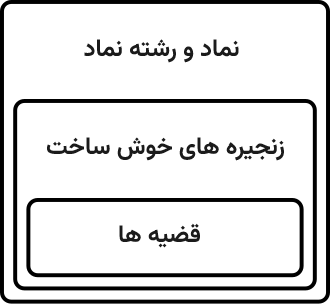

یک **نظام صوری** (Formal System) یا **نظام استنتاجی** (Deductive System)، ساختاری انتزاعی و صورت‌بندی‌شده از یک نظام اصل‌موضوعی (Axiomatic System) است که برای استنتاج قضایا (Theorems) از اصول موضوعه (Axioms)، با استفاده از قواعد استنتاج (Rules of Inference)، به کار می‌رود.

در سال ۱۹۲۱، دیوید هیلبرت (David Hilbert) پیشنهاد کرد که نظام‌های صوری به‌عنوان بنیان دانش در ریاضیات مورد استفاده قرار گیرند. با این حال، در سال ۱۹۳۱، کورت گودل (Kurt Gödel) اثبات کرد که هر نظام صوری سازگار (Consistent) که به اندازهٔ کافی نیرومند باشد تا حساب مقدماتی را بیان کند، نمی‌تواند کامل بودن (Completeness) خود را اثبات کند. این نتیجه عملاً نشان داد که برنامهٔ هیلبرت، با صورتی که ارائه شده بود، امکان‌پذیر نیست.

اصطلاح **فرمالیسم** (Formalism) گاهی به‌طور تقریبی مترادف با «نظام صوری» به کار می‌رود؛ اما این اصطلاح همچنین می‌تواند به سبک خاصی از نمادگذاری اشاره داشته باشد؛ برای مثال، نمادگذاری برا-کت (Bra–Ket Notation) که توسط پل دیراک (Paul Dirac) ارائه شد.

## مفاهیم

یک نظام صوری حداقل دارای مؤلفه‌های زیر است:

- **زبان صوری** (Formal Language): مجموعه‌ای از فرمول‌های خوش‌ساخت (Well-formed Formulas) که رشته‌هایی از نمادها (Symbols) از یک الفبا (Alphabet) هستند و به وسیلهٔ یک دستور زبان صوری (Formal Grammar) ساخته می‌شوند. این دستور زبان شامل قواعد تولید (Production Rules) یا قواعد تشکیل (Formation Rules) است.

- **نظام استنتاجی** (Deductive System)، دستگاه استنتاجی (Deductive Apparatus) یا نظام برهان (Proof System): مجموعه‌ای از قواعد استنتاج (Rules of Inference) که اصول موضوعه (Axioms) را دریافت می‌کنند و قضایا (Theorems) را از آن‌ها استنتاج می‌کنند. هم اصول موضوعه و هم قضایا بخشی از زبان صوری هستند.

- در برخی موارد، یک **نظام استقرایی** (Inductive System) نیز وجود دارد که برای به‌دست‌آوردن یک برهان به کار می‌رود؛ به این صورت که ابتدا یک حالت ساده اثبات می‌شود و سپس این نتیجه به حالت‌های کلی‌تر تعمیم داده می‌شود.

یک نظام صوری زمانی **بازگشتی** (Recursive) یا **مؤثر** (Effective) نامیده می‌شود که مجموعهٔ اصول موضوعه و مجموعهٔ قواعد استنتاج آن، به‌ترتیب، مجموعه‌های تصمیم‌پذیر (Decidable Sets) یا نیمه‌تصمیم‌پذیر (Semidecidable Sets) باشند؛ یعنی بتوان دربارهٔ عضویت عناصر در این مجموعه‌ها با روش‌های محاسباتی مشخص تصمیم گرفت یا دست‌کم آن را بررسی کرد.

### زبان صوری

زبان صوری زبانی است که از مجموعه‌ای از رشته‌ها تشکیل شده است؛ رشته‌هایی که نمادهای آن‌ها از یک الفبای مشخص گرفته شده‌اند و با استفاده از عملیاتی معین، جمله‌ها یا عبارات آن زبان را می‌سازند. همانند زبان‌های موجود در زبان‌شناسی، زبان‌های صوری نیز معمولاً دارای دو جنبه هستند:

- **نحو** (Syntax): به شکل و ساختار زبان مربوط است؛ یا به بیان دقیق‌تر، مجموعهٔ عبارت‌های ممکنی است که در آن زبان، گفتارهای معتبر محسوب می‌شوند.

- **معناشناسی** (Semantics): به معنای عبارات زبان مربوط است؛ معنایی که بسته به نوع زبان مورد نظر، به شیوه‌های مختلف صورت‌بندی می‌شود.

معمولاً تنها نحو یک زبان صوری از طریق مفهوم **دستور زبان صوری** (Formal Grammar) بررسی می‌شود. دو دستهٔ اصلی دستور زبان‌های صوری عبارت‌اند از:

1. **دستور زبان‌های زایشی** (Generative Grammars): مجموعه‌ای از قواعد برای این‌که چگونه رشته‌های یک زبان می‌توانند تولید شوند.

2. **دستور زبان‌های تحلیلی** (Analytic Grammars) یا دستور زبان‌های کاهشی (Reductive Grammars): مجموعه‌ای از قواعد برای این‌که چگونه یک رشته تحلیل شود تا مشخص گردد آیا آن رشته عضوی از زبان هست یا نه.

### نظام استنتاجی

یک **نظام استنتاجی** که با عنوان **دستگاه استنتاجی** نیز شناخته می‌شود، شامل اصول موضوعه (یا طرحواره‌های اصل موضوعی) و قواعد استنتاجی است که می‌توان با استفاده از آن‌ها قضایای نظام را استخراج کرد.

برای حفظ تمامیت استنتاجی، یک دستگاه استنتاجی باید بدون ارجاع به هیچ‌گونه تفسیر مورد نظر (Intended Interpretation) از زبان قابل تعریف باشد. هدف این است که هر خط از یک استخراج یا برهان، صرفاً پیامد منطقی خطوط پیشین خود باشد. نباید هیچ عنصری از تفسیر زبان در ماهیت استنتاجی نظام دخالت کند.

پیامد منطقی (Logical Consequence) یا استلزام (Entailment) که از بنیان منطقی نظام ناشی می‌شود، چیزی است که یک نظام صوری را از نظام‌هایی که ممکن است بر یک مدل انتزاعی مبتنی باشند، متمایز می‌کند. در بسیاری از موارد، نظام صوری مبنای یک نظریه یا حوزهٔ گسترده‌تر است، یا حتی با آن یکی دانسته می‌شود؛ مانند هندسهٔ اقلیدسی که در ریاضیات جدید با کاربردهای نظریهٔ مدل‌ها سازگار است.

نمونه‌ای از یک نظام استنتاجی، قواعد استنتاج و اصول موضوعهٔ مربوط به تساوی در منطق مرتبهٔ اول (First-order Logic) است.

دو نوع اصلی نظام‌های استنتاجی عبارت‌اند از:

- نظام‌های برهان (Proof Systems)
- معناشناسی‌های صوری (Formal Semantics)

### نظام برهان

برهان‌های صوری، دنباله‌هایی از فرمول‌های خوش‌ساخت (WFF) هستند که هر یک از آن‌ها یا یک اصل موضوعه‌اند، یا از طریق اعمال یک قاعدهٔ استنتاج بر فرمول‌های خوش‌ساخت قبلی در زنجیرهٔ برهان به دست آمده‌اند.

هنگامی که یک نظام صوری مشخص شد، می‌توان مجموعهٔ قضایایی را که در درون آن نظام قابل اثبات هستند تعریف کرد. این مجموعه شامل تمام فرمول‌های خوش‌ساختی است که برای آن‌ها یک برهان وجود دارد. بنابراین، همهٔ اصول موضوعه نیز قضیه محسوب می‌شوند.

برخلاف دستور زبان مربوط به فرمول‌های خوش‌ساخت، هیچ تضمینی وجود ندارد که برای تشخیص این‌که یک فرمول خوش‌ساخت معین قضیه هست یا نه، یک روش تصمیم‌گیری (Decision Procedure) وجود داشته باشد.

دیدگاهی که بر اساس آن، تولید برهان‌های صوری تمام چیزی است که ریاضیات را تشکیل می‌دهد، اغلب **فرمالیسم** (Formalism) نامیده می‌شود. دیوید هیلبرت، فرا‌ریاضیات (Metamathematics) را به‌عنوان حوزه‌ای برای بررسی نظام‌های صوری بنیان گذاشت.

هر زبانی که برای سخن گفتن دربارهٔ یک نظام صوری به کار رود، **فرا‌زبان** (Metalanguage) نامیده می‌شود. فرازبان ممکن است یک زبان طبیعی باشد یا خود تا حدی صورت‌بندی صوری شده باشد؛ اما معمولاً نسبت به مؤلفهٔ زبان صوریِ نظام مورد بررسی، درجهٔ کمتری از صورت‌مندی دارد. آن مؤلفهٔ زبان صوری، **زبان موضوع** (Object Language) نامیده می‌شود؛ یعنی زبانی که خود موضوع بحث قرار گرفته است.

مفهوم «قضیه» که در اینجا تعریف شد، نباید با «قضایا دربارهٔ نظام صوری» اشتباه گرفته شود. برای جلوگیری از این ابهام، قضایای مربوط به خود نظام صوری معمولاً **فرا‌قضیه** (Metatheorem) نامیده می‌شوند.

### معناشناسی صوری نظام‌های منطقی

یک **نظام منطقی** عبارت است از یک نظام استنتاجی (که معمولاً منطق مرتبهٔ اول است) به همراه اصول موضوعهٔ غیرمنطقی اضافی.

بر اساس نظریهٔ مدل‌ها (Model Theory)، یک نظام منطقی می‌تواند دارای تفسیرهایی باشد که مشخص می‌کنند آیا یک ساختار معین ـ یعنی نگاشت فرمول‌ها به معناهای خاص ـ یک فرمول خوش‌ساخت را ارضا می‌کند یا نه. ساختاری که همهٔ اصول موضوعهٔ نظام صوری را ارضا کند، **مدل** (Model) آن نظام منطقی نامیده می‌شود.

یک نظام منطقی:

- **صحت‌مند** (Sound) است، اگر هر فرمول خوش‌ساختی که از اصول موضوعه استنتاج می‌شود، در تمام مدل‌های نظام منطقی صادق باشد.

- **از نظر معنایی کامل** (Semantically Complete) است، اگر هر فرمول خوش‌ساختی که در تمام مدل‌های نظام منطقی صادق باشد، بتواند از اصول موضوعه استنتاج شود.

نمونه‌ای از یک نظام منطقی، **حساب پئانو** (Peano Arithmetic) است. مدل استاندارد حساب، حوزهٔ گفت‌وگو (Domain of Discourse) را مجموعهٔ اعداد صحیح نامنفی قرار می‌دهد و به نمادها معنای معمول آن‌ها را اختصاص می‌دهد. البته مدل‌های غیر استاندارد حساب نیز وجود دارند.

## تاریخچه

نخستین نظام‌های منطقی شامل **منطق هندیِ پانینی** (Pāṇini)، **منطق قیاسی ارسطو**، **منطق گزاره‌ای رواقیان** و **منطق چینیِ گونگسون لونگ** (Gongsun Long، حدود ۳۲۵ تا ۲۵۰ پیش از میلاد) بودند.

در دوران جدید، از جمله چهره‌های اثرگذار در این حوزه می‌توان به **جرج بول** (George Boole)، **آگوستوس دِ مورگان** (Augustus De Morgan) و **گوتلوب فرگه** (Gottlob Frege) اشاره کرد. **منطق ریاضی** (Mathematical Logic) نیز در سدهٔ نوزدهم در اروپا توسعه یافت.

**دیوید هیلبرت** (David Hilbert) جنبشی فرمالیستی را با عنوان **برنامهٔ هیلبرت** (Hilbert's Program) پایه‌گذاری کرد. این برنامه به‌عنوان راه‌حلی پیشنهادی برای **بحران مبانی ریاضیات** (Foundational Crisis of Mathematics) ارائه شد، اما بعدها با انتشار **قضایای ناتمامیت گودل** (Gödel's Incompleteness Theorems) دامنه و اهداف آن تعدیل شد.

**بیانیهٔ QED** (QED Manifesto) نیز تلاشی متأخر برای صورت‌بندی صوریِ کل ریاضیات شناخته‌شده بود؛ تلاشی که تاکنون به موفقیت کامل نرسیده است.

## لیست نظام های صوری

این فهرستی از **نظام‌های صوری** (Formal Systems) است که با عنوان **حساب‌های منطقی** (Logical Calculi) نیز شناخته می‌شوند.

### ریاضی

- **حساب تابعی** (Functional Calculus): روشی برای اعمال انواع مختلف توابع بر عملگرها.
- **حساب ماتریسی** (Matrix Calculus): دستگاه نمادگذاری تخصصی برای حساب چندمتغیره در فضاهای ماتریسی.
- **حساب آمبرال** (Umbral Calculus): شاخه‌ای از ترکیبیات که به بررسی برخی عملیات خاص روی چندجمله‌ای‌ها می‌پردازد.
- **حساب برداری** (Vector Calculus) یا **آنالیز برداری** (Vector Analysis): مجموعه‌ای از نمادگذاری‌ها و روش‌های تخصصی برای تحلیل چندمتغیرهٔ بردارها در فضاهای دارای ضرب داخلی.

### حساب‌های منطقی

- **حساب محمولات** (Predicate Calculus): قواعد استنتاج حاکم بر منطق محمولات را مشخص می‌کند.
- **حساب گزاره‌ها** (Propositional Calculus): قواعد استنتاج حاکم بر منطق گزاره‌ها را مشخص می‌کند.

### در علوم نظری رایانه (زبان‌های صوری)

- **حساب μ موجه** (Modal μ-Calculus): یکی از منطق‌های زمانی پرکاربرد که در روش‌های اثبات صوری، مانند وارسی مدل (Model Checking)، استفاده می‌شود.
- **حساب لامبدا** (Lambda Calculus): صورت‌بندی نظریهٔ توابع بازگشتی که ارتباط عمیقی با نظریهٔ محاسبه دارد.
  - **حساب کاپا** (Kappa Calculus): بازصورت‌بندی بخش مرتبهٔ اولِ حساب لامبدای نوع‌بندی‌شده.
  - **حساب رو** (Rho Calculus): دستگاهی که برای یکپارچه‌سازی یکنواخت بازنویسی (Rewriting) با حساب لامبدا معرفی شده است.
- **حساب فرایندها** (Process Calculus): مجموعه‌ای از رویکردها برای صورت‌بندی مدل‌های صوری سامانه‌های هم‌زمان (Concurrent Systems).
  - **حساب محیط** (Ambient Calculus): خانواده‌ای از مدل‌های سامانه‌های هم‌زمان که بر مفهوم جابه‌جایی عامل‌ها (Agent Mobility) استوارند.
  - **حساب پیوند** (Join Calculus): مدلی نظری برای طراحی زبان‌های برنامه‌نویسی توزیع‌شده.
  - **حساب π** (π-Calculus): صورت‌بندی نظریهٔ فرایندهای هم‌زمان و ارتباطی که توسط رابین میلنر (Robin Milner) ابداع شد.
- **حساب رابطه‌ای** (Relational Calculus): دستگاهی برای مدل دادهٔ رابطه‌ای.
  - **حساب رابطه‌ای دامنه‌ای** (Domain Relational Calculus)
  - **حساب تاپل** (Tuple Calculus): مبنای الهام‌بخش زبان SQL.
- **حساب پالایش** (Refinement Calculus): روشی برای تبدیل تدریجی مدل‌های برنامه به برنامه‌های کارآمد.

### دیگر نظام‌های صوری

- **اخلاق صوری** (Formal Ethics)