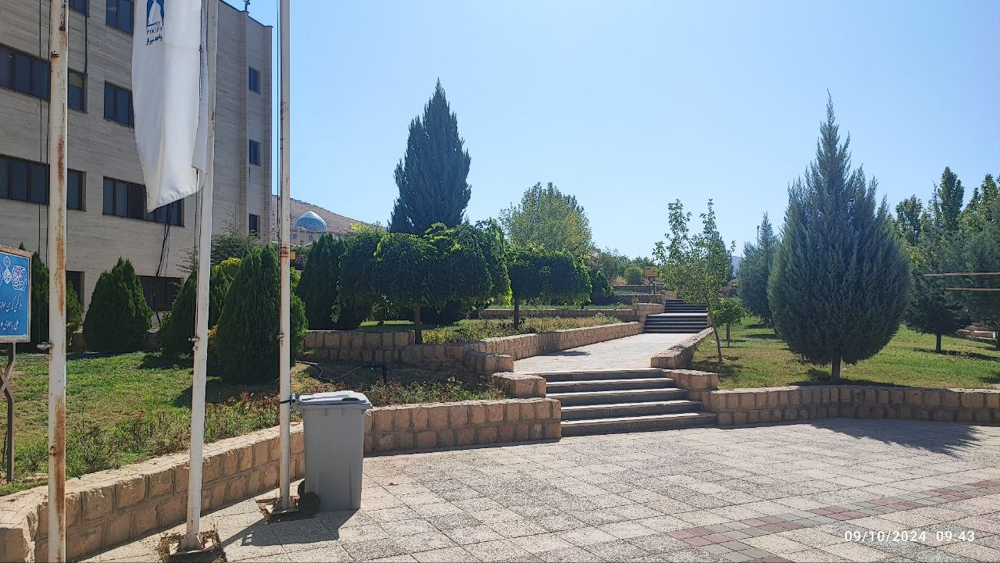

## +

دکتری فلسفه، دانشگاه شیراز قبول شدم. برای ثبت نام خواستند ریز نمرات کارشناسی ام ارائه شود.

صبح که احمدعلی را رساندم مهد کودک، آمدم صدرا؛ دانشگاه آزاد اسلامی شیراز، دانشگاه دوره کارشناسی ام. کارشناسی مهندسی کامپیوتر - گرایش نرم افزار.

ساختمان های قبلی عوض نشده بودند اما دانشگاه خیلی بزرگتر شده بود. چندین ساختمان و جاده و خوابگاه اضافه شده بود.

## +

هنوز گوشه گوشه دانشگاه برایم آشنا بود.

ساختمان مهندسی، کلاس ها، نمازخانه، محوطه جلوی دانشکده،

کتابخانه، سلف. انتشارات، ایستگاه اتوبوس.

پرتاب می شوم به روزهای لیسانس. به آن شوق ها، کشف ها، ترس ها و اضطراب ها.

به عشقم به کامپیوتر، لذتم از ساختن برنامه. حل مسئله با کامپیوتر.

به آن ترم که مشروط شدم و تحقیر شدم. و از هم کلاسی هایم عقب افتادم. تنها شدم.

## +

در پیاده رو های دانشکده راه می روم. برگ چنار های کنار پیاده رو زرد شده اند و باد آرامی که می وزد، آنها را از درخت جدا می کند و به زمین می نشاند.

درخت، همه جوش و خروش بهار و تابستان آن برگ های نازک و تر را فراموش می کند و به خواب می رود، تا سالی دیگر برگ های جدید بیافریند بی خبر از سرنوشت آفریده های دیروز...

کجا هستند آن جوانه ها، آن طراوت و تازگی ها و آن همه اشتیاق دیدن نور؟

سرنوشت این برگ ها که به دست باد سپرده می شوند چیست؟ به کجا می روند و اثری از آنها خواهد ماند؟

کجا هستند آن شوق ها، آن امید ها؟ کجا رفتند رفیقان، هم صحبتتان، یاران.

# +

به هر جا بروم، حتی آن روز که می میرم؛ عاشق تو خواهم ماند کوچه های دانشکده مهندسی دانشگاه آزاد شیراز.

    